# 8. Diagrama de Classes do Domínio

Este diagrama foca-se no domínio do problema e nas relações de negócio puras entre as entidades do campeonato, alinhado com o estilo académico da disciplina.

### Código PlantUML do Domínio

```plantuml
@startuml
skinparam classAttributeIconSize 0
skinparam packageStyle rectangle
skinparam linetype ortho
skinparam nodesep 60
skinparam ranksep 60

package "ZONA NORTE: Entidades Principais" as Norte {
    class Jogo {
        - id: int
        - data: String
        - hora: String
        - estadio: Estadio
        - equipaCasa: Equipa
        - equipaFora: Equipa
        - estado: EstadoJogo
        - fase: String
        - vencedor: Equipa
        - golosCasa: int
        - golosFora: int
        - penaltisCasa: int
        - penaltisFora: int
        - escalaArbitros: EscalaoArbitral
        - eventos: List<EventoJogo>
        - estatisticas: EstatisticaJogo
        - proximoJogo: Jogo
        - posicaoNoProximoJogo: PosicaoBracket
        + Jogo(id: int, data: String, hora: String, estadio: Estadio, equipaCasa: Equipa, equipaFora: Equipa, fase: String, estado: EstadoJogo)
        + obterEscalaArbitrosPublica(): EscalaoArbitral
        + associarEscalaArbitros(escala: EscalaoArbitral): void
        + adicionarEvento(evento: EventoJogo): void
        + finalizar(vencedor: Equipa, golosCasa: int, golosFora: int, penaltisCasa: int, penaltisFora: int, estatisticas: EstatisticaJogo): void
    }

    class Equipa {
        - nome: String
        - treinador: String
        - jogadores: List<Jogador>
        + Equipa(nome: String, treinador: String)
        + adicionarJogador(jogador: Jogador): boolean
        + removerJogador(jogadorId: int): void
    }

    class Estadio {
        - nome: String
        - localizacao: String
        - setores: List<SetorEstadio>
        + Estadio(nome: String, localizacao: String)
        + adicionarSetor(setor: SetorEstadio): void
        + obterSetorPorNome(nome: String): SetorEstadio
        + toString(): String
    }

    class Arbitro {
        - id: int
        - email: String
        - nome: String
        - nacionalidade: String
        - tipo: TipoArbitro
        - estado: EstadoArbitro
        - pontuacaoFIFA: int
        - totalAvaliacoes: int
        + Arbitro(id: int, email: String, nome: String, nacionalidade: String, tipo: TipoArbitro, estado: EstadoArbitro)
        + registarAvaliacao(pontuacao: int): void
        + reporPontuacao(): void
    }
}

package "ZONA SUL: Entidades Dependentes" as Sul {
    class Jogador {
        - id: int
        - numeroCamisola: int
        - nome: String
        - posicao: String
        - estado: EstadoJogador
        - golos: int
        - assistencias: int
        - titular: boolean
        - cartoesAmarelos: int
        - cartoesVermelhos: int
        - energia: int
        - historicoLesoes: List<String>
        + Jogador(id: int, numeroCamisola: int, nome: String, posicao: String, estado: EstadoJogador)
        + adicionarLesao(lesao: String): void
        + incrementarGolos(): void
        + incrementarAssistencias(): void
    }

    class SetorEstadio {
        - nome: String
        - capacidadeTotal: int
        - bilhetesVendidos: int
        - precoBase: double
        + SetorEstadio(nome: String, capacidadeTotal: int, precoBase: double)
        + venderBilhete(quantidade: int): boolean
    }

    class EscalaoArbitral {
        - principal: Arbitro
        - assistente1: Arbitro
        - assistente2: Arbitro
        - quarto: Arbitro
        - var: Arbitro
        + EscalaoArbitral(principal: Arbitro, assistente1: Arbitro, assistente2: Arbitro, quarto: Arbitro, var: Arbitro)
    }

    class EventoJogo {
        - minuto: int
        - tipo: TipoEvento
        - jogador: Jogador
        - equipa: Equipa
        + EventoJogo(minuto: int, tipo: TipoEvento, jogador: Jogador, equipa: Equipa)
    }

    class EstatisticaJogo {
        - posseBolaCasa: int
        - posseBolaFora: int
        - rematesCasa: int
        - rematesFora: int
        - cantosCasa: int
        - cantosFora: int
        + EstatisticaJogo(posseBolaCasa: int, posseBolaFora: int, rematesCasa: int, rematesFora: int, cantosCasa: int, cantosFora: int)
    }
}

package "ZONA LESTE: Serviços Auxiliares" as Leste {
    class Bilhete {
        - jogoId: int
        - setor: String
        - preco: double
        + Bilhete(jogoId: int, setor: String, preco: double)
    }

    class Hotel {
        - id: int
        - nome: String
        - localizacao: String
        - capacidadeQuartos: int
        - checkInDate: String
        - checkOutDate: String
        - equipaHospedada: Equipa
        + Hotel(id: int, nome: String, localizacao: String, capacidadeQuartos: int)
        + checkIn(equipa: Equipa, checkInDate: String, checkOutDate: String): boolean
        + checkOut(): void
    }

    class Viagem {
        - origem: String
        - destino: String
        - dataPartida: String
        - dataChegada: String
        - meioTransporte: String
        + Viagem(origem: String, destino: String, dataPartida: String, dataChegada: String, meioTransporte: String)
    }

    class Utilizador {
        - email: String
        - nome: String
        - cargo: TipoUtilizador
        - equipaAssociada: String
        + Utilizador(email: String, nome: String, cargo: TipoUtilizador, equipaAssociada: String)
    }

    class ClassificacaoLinha {
        - equipa: Equipa
        - pontos: int
        - jogados: int
        - vitorias: int
        - empates: int
        - derrotas: int
        - golosMarcados: int
        - golosSofridos: int
        - saldoGolos: int
        + ClassificacaoLinha(equipa: Equipa)
        + adicionarResultado(golosMarcados: int, golosSofridos: int): void
    }
}

package "ZONA SUDESTE: Enumerations" as Sudeste {
    enum TipoUtilizador {
        ADMIN
        GESTOR_ARBITRAGEM
        GESTOR_EQUIPA
        GESTOR_LOGISTICA
        GESTOR_BILHETEIRA
        PUBLICO
    }

    enum EstadoJogo {
        AGENDADO
        EM_CURSO
        FINALIZADO
    }

    enum EstadoJogador {
        APTO
        LESIONADO
        SUSPENSO
    }

    enum EstadoArbitro {
        ATIVO
        DESCANSO
        INATIVO
    }

    enum TipoArbitro {
        PRINCIPAL
        ASSISTENTE
        VAR
        QUARTO
    }

    enum TipoEvento {
        GOLO
        AUTO_GOLO
        CARTAO_AMARELO
        CARTAO_VERMELHO
        SUBSTITUICAO
    }

    enum PosicaoBracket {
        HOME
        AWAY
    }
}

' Layout hints
Norte -[hidden]down-> Sul
Norte -[hidden]right-> Leste
Leste -[hidden]down-> Sudeste

' === Relacionamentos ===
Equipa "1" *-- "0..26" Jogador : jogadores
Estadio "1" *-- "1..*" SetorEstadio : setores
Jogo "0..*" o-- "0..1" Equipa : equipaCasa
Jogo "0..*" o-- "0..1" Equipa : equipaFora
Jogo "0..*" o-- "1" Estadio : estadio
Jogo "1" *-- "0..*" EventoJogo : eventos
Jogo "1" o-- "0..1" EstatisticaJogo : estatisticas
Jogo "1" o-- "0..1" EscalaoArbitral : escalaArbitros
Jogo "0..1" --> "0..1" Jogo : proximoJogo
EscalaoArbitral "1" o-- "1" Arbitro : principal
EscalaoArbitral "1" o-- "0..1" Arbitro : assistente1
EscalaoArbitral "1" o-- "0..1" Arbitro : assistente2
EscalaoArbitral "1" o-- "0..1" Arbitro : quarto
EscalaoArbitral "1" o-- "0..1" Arbitro : var
EventoJogo "0..*" o-- "1" Jogador : jogador
EventoJogo "0..*" o-- "1" Equipa : equipa
Hotel "0..*" o-- "0..1" Equipa : equipaHospedada
ClassificacaoLinha "0..*" o-- "1" Equipa : equipa

' Associacoes adicionais para classes anteriormente isoladas
Bilhete "0..*" ..> Jogo : refere-se a (jogoId)
Utilizador "0..*" ..> Equipa : associado a
Viagem "0..*" ..> Equipa : transporte de
Viagem "0..*" ..> Jogo : para

Utilizador ..> TipoUtilizador
Jogador ..> EstadoJogador
Arbitro ..> EstadoArbitro
Arbitro ..> TipoArbitro
Jogo ..> EstadoJogo
Jogo ..> PosicaoBracket
EventoJogo ..> TipoEvento
@enduml
```

