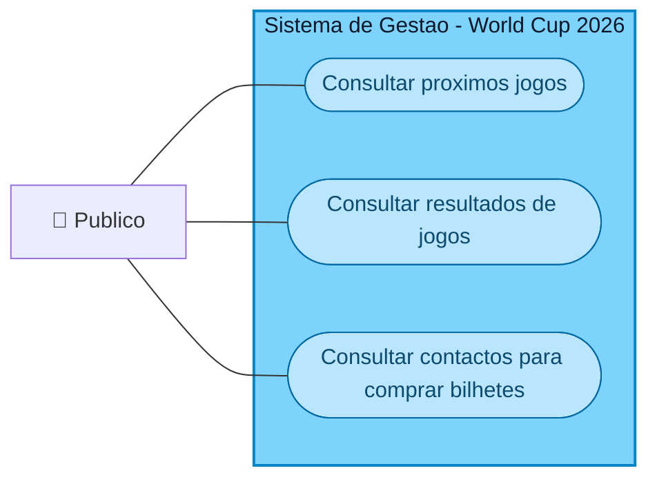
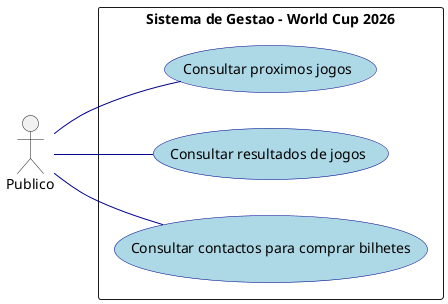
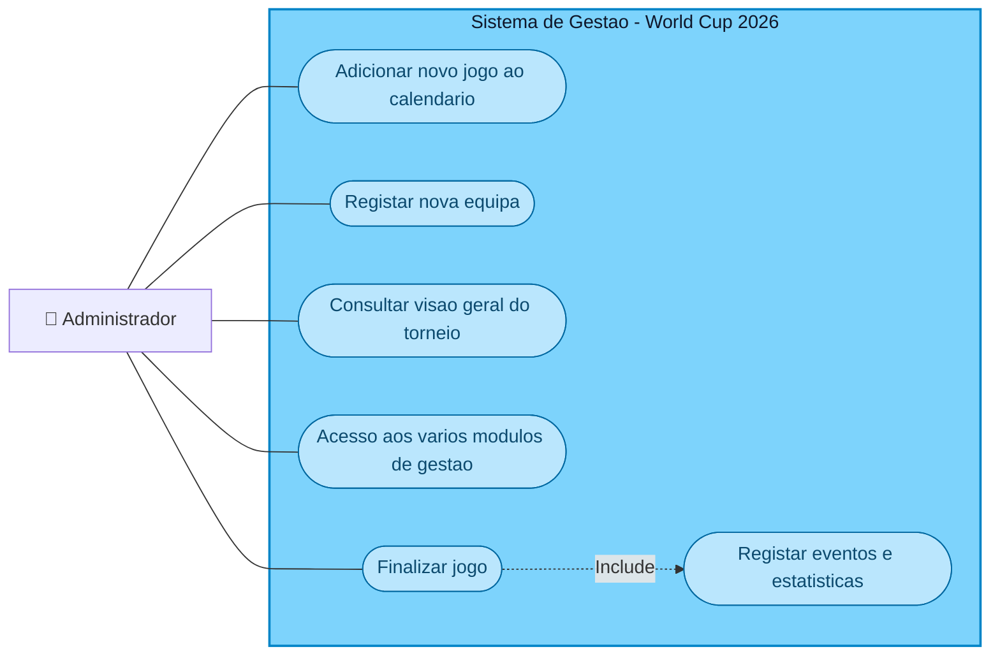
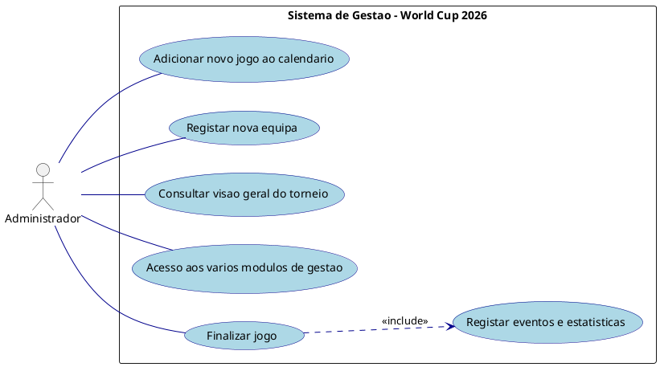
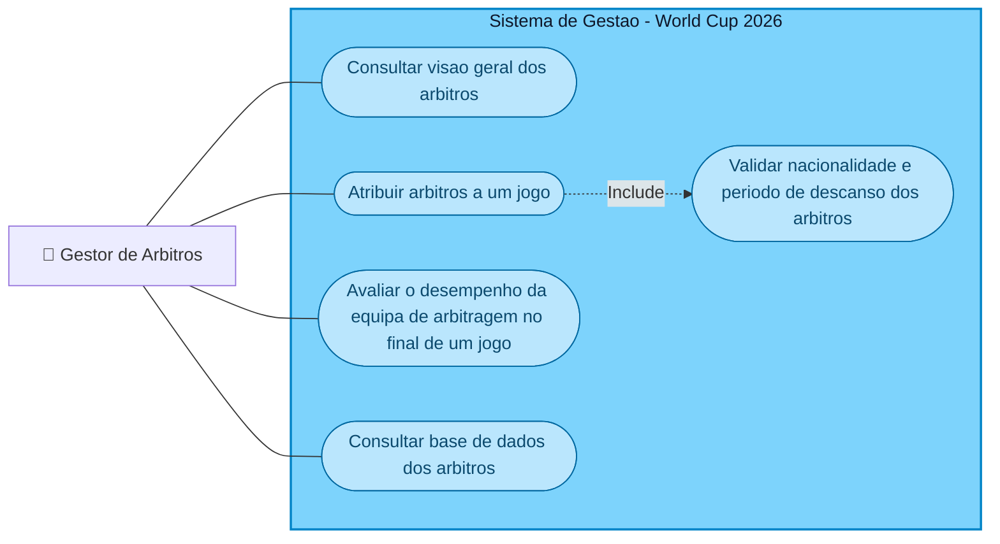
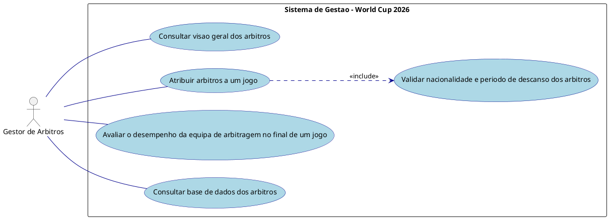
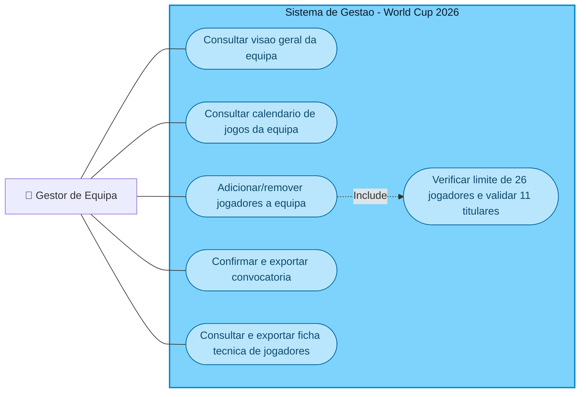
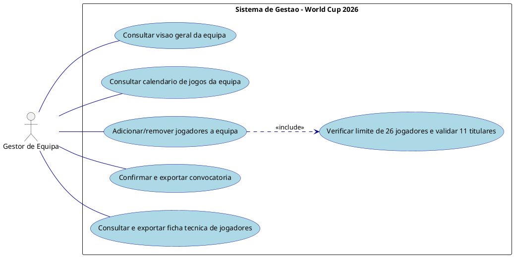
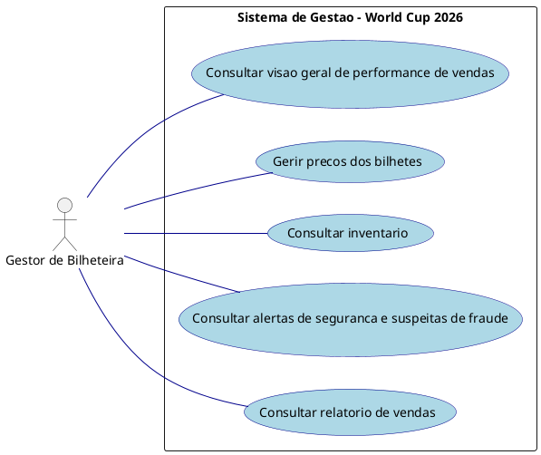

# Especificacao Fiel de Casos de Uso - ICONIX / UML (Fase 1)

Este documento apresenta a modelacao de Casos de Uso do **Sistema de Gestao do Campeonato do Mundo 2026**.
Para garantir **100% de conformidade e exatidao** com as imagens de referencia oficiais do projeto, o sistema esta modelado em **5 diagramas independentes**, representando cada perfil de utilizador e as suas respetivas elipses e relacionamentos `<<Include>>`.

---

## 1. Publico

**Ator:** Publico  
**Descricao:** Acesso externo nao autenticado para consulta de informacoes gerais do torneio.

### Diagrama Mermaid


### Codigo PlantUML (Visual Paradigm)


---

## 2. Administrador

**Ator:** Administrador  
**Descricao:** Perfil de gestao global com controlo total sobre o agendamento de jogos, equipas e visao geral do torneio.

### Diagrama Mermaid


### Codigo PlantUML (Visual Paradigm)


---

## 3. Gestor de Arbitros

**Ator:** Gestor de Arbitros  
**Descricao:** Gestao especializada da equipa de arbitragem, incluindo atribuicao a jogos e avaliacao de desempenho.

### Diagrama Mermaid


### Codigo PlantUML (Visual Paradigm)


---

## 4. Gestor de Equipa

**Ator:** Gestor de Equipa  
**Descricao:** Perfil dedicado aos selecionadores nacionais para convocatorias, gestao de planteis e consulta de calendario.

### Diagrama Mermaid


### Codigo PlantUML (Visual Paradigm)


---

## 5. Gestor de Bilheteira

**Ator:** Gestor de Bilheteira  
**Descricao:** Controlo financeiro, inventario de ingressos, definicao de precos e monitorizacao de seguranca/fraude.

### Diagrama Mermaid
```mermaid
flowchart LR
  GBilh["🧍 Gestor de Bilheteira"]
  subgraph Sistema["Sistema de Gestao - World Cup 2026"]
    direction TB
    CU1(["Consultar visao geral de performance de vendas"])
    CU2(["Gerir precos dos bilhetes"])
    CU3(["Consultar inventario"])
    CU4(["Consultar alertas de seguranca e suspeitas de fraude"])
    CU5(["Consultar relatorio de vendas"])
  end
  GBilh --- CU1
  GBilh --- CU2
  GBilh --- CU3
  GBilh --- CU4
  GBilh --- CU5

  style Sistema fill:#7DD3FC,stroke:#0284C7,stroke-width:2px,color:#0f172a
  style CU1 fill:#BAE6FD,stroke:#0369A1,color:#0c4a6e,stroke-width:1px
  style CU2 fill:#BAE6FD,stroke:#0369A1,color:#0c4a6e,stroke-width:1px
  style CU3 fill:#BAE6FD,stroke:#0369A1,color:#0c4a6e,stroke-width:1px
  style CU4 fill:#BAE6FD,stroke:#0369A1,color:#0c4a6e,stroke-width:1px
  style CU5 fill:#BAE6FD,stroke:#0369A1,color:#0c4a6e,stroke-width:1px
```

### Codigo PlantUML (Visual Paradigm)


---

## Confirmacao de Exatidao

Os 5 diagramas documentados acima correspondem com **100% de exatidao e fidelidade** as imagens oficiais do projeto, garantindo o alinhamento total entre a especificacao UML e o prototipo funcional desenvolvido.
