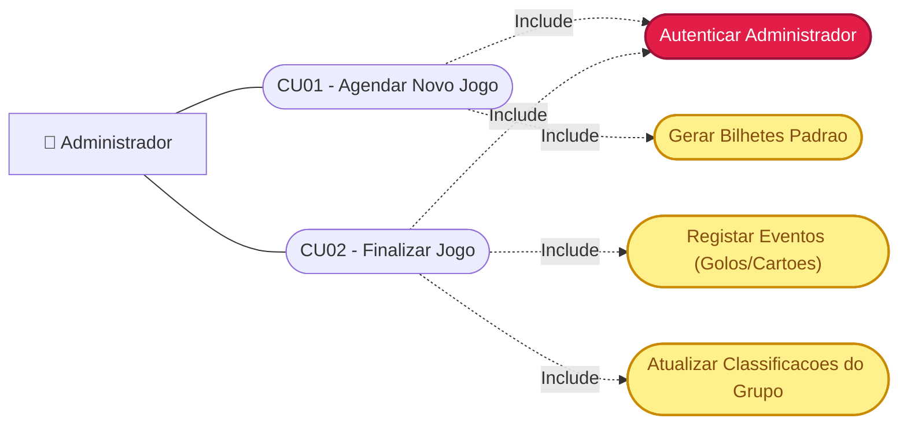
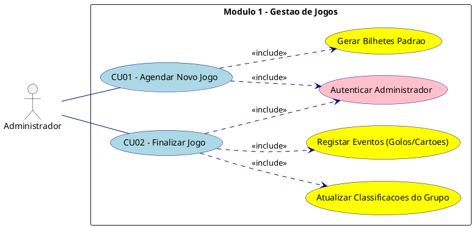
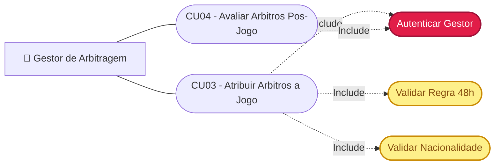
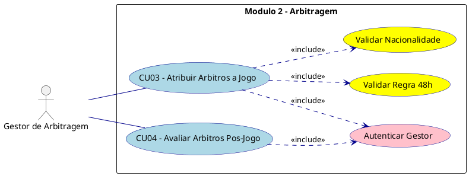
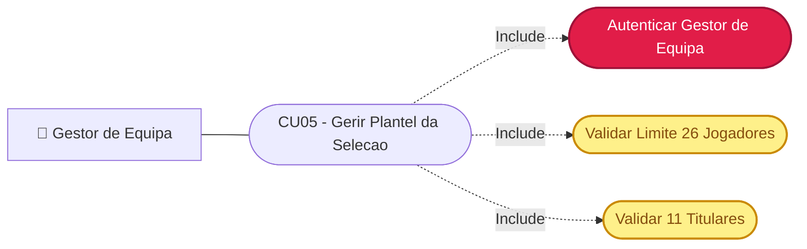
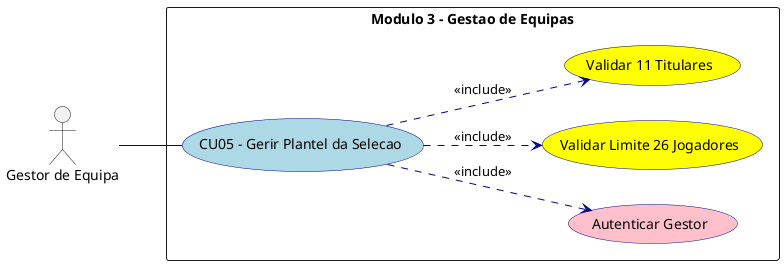
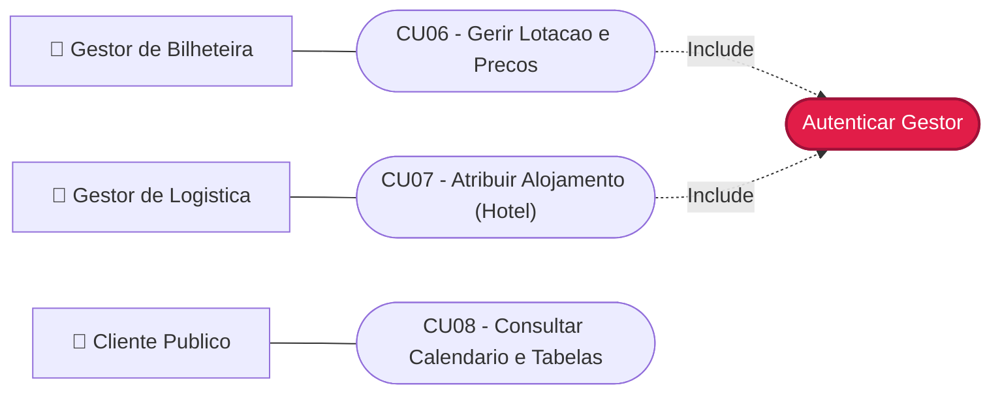
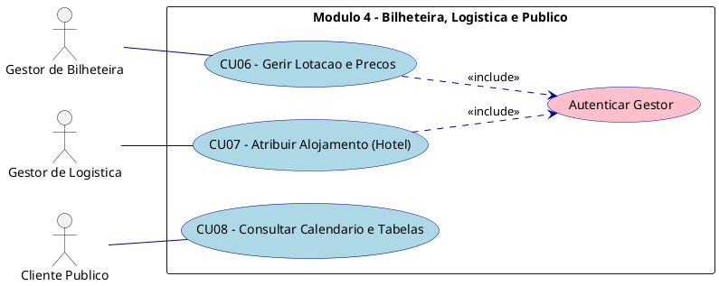

# Especificacao Modular de Casos de Uso - ICONIX (Fase 1)

Este documento apresenta a modelacao de Casos de Uso do **Sistema de Gestao do Campeonato do Mundo 2026**. 
Para garantir a maxima clareza, simplicidade e facilidade de leitura (conforme as boas praticas da metodologia ICONIX e os slides da disciplina), os casos de uso foram divididos em **4 modulos funcionais separados**.

---

## 1. Modulo de Gestao de Jogos e Calendario (Administrador)

**Ator:** Administrador  
**Foco:** Agendamento de novas partidas, geracao de bilhetes padrao e finalizacao de jogos com calculo automatico de classificacoes.

### Diagrama Mermaid

### Codigo PlantUML (Visual Paradigm)

---

## 2. Modulo de Gestao de Arbitragem (Gestor de Arbitragem)

**Ator:** Gestor de Arbitragem  
**Foco:** Atribuicao de equipas de arbitragem com validacao estrita de regras FIFA (descanso de 48h e neutralidade de nacionalidade) e avaliacao de desempenho pos-jogo.

### Diagrama Mermaid

### Codigo PlantUML (Visual Paradigm)

---

## 3. Modulo de Gestao de Equipas e Planteis (Gestor de Equipa)

**Ator:** Gestor de Equipa (Selecionador)  
**Foco:** Convocatoria de jogadores, garantindo o cumprimento do limite regulamentar de 26 atletas e a selecao dos 11 titulares para cada partida.

### Diagrama Mermaid

### Codigo PlantUML (Visual Paradigm)

---

## 4. Modulo de Bilheteira, Logistica e Consulta Publica

**Atores:** Gestor de Bilheteira, Gestor de Logistica, Cliente Publico  
**Foco:** Venda e gestao de ingressos, alocacao de centros de estagio/hoteis para as selecoes e acesso publico aos calendarios e tabelas classificativas.

### Diagrama Mermaid

### Codigo PlantUML (Visual Paradigm)

---

## Resumo Metodologico (Estereotipos)

Conforme ilustrado no slide 23 da disciplina:
1. **`<<Include>>`:** Utilizado para demonstrar que um caso de uso base invoca obrigatoriamente um sub-caso ou validacao de sistema (ex: Autenticacao ou regras de negocio).
2. **Modularidade:** A separacao em 4 diagramas distintos elimina a complexidade visual, permitindo uma analise direta e limpa de cada dominio do sistema.
