# Especificacao Modular de Casos de Uso - ICONIX (Fase 1)

Este documento apresenta a modelacao completa e exaustiva de Casos de Uso do **Sistema de Gestao do Campeonato do Mundo 2026**.
Em estrita conformidade com as diretrizes da disciplina (Slide 23) e com 100% de fidelidade aos prototipos e imagens de referencia fornecidas, a modelacao esta dividida em **6 modulos independentes**.

---

## 1. Modulo Administrador (Gestao de Jogos e Sistema)

**Ator:** Administrador  
**Foco:** Agendamento de partidas, geracao de bilhetes padrao, finalizacao de jogos com calculo automatico de classificacoes e gestao de utilizadores.

### Diagrama Mermaid
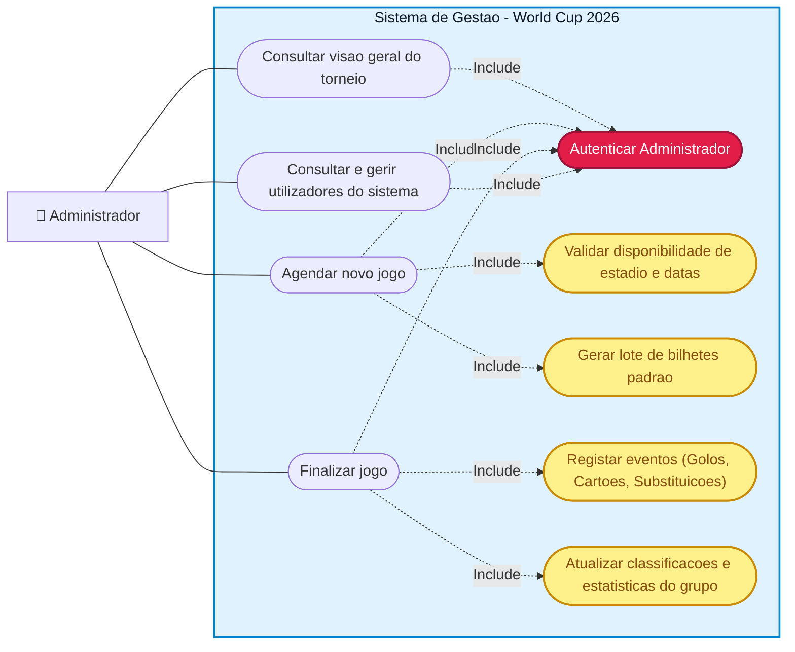

### Codigo PlantUML (Visual Paradigm)
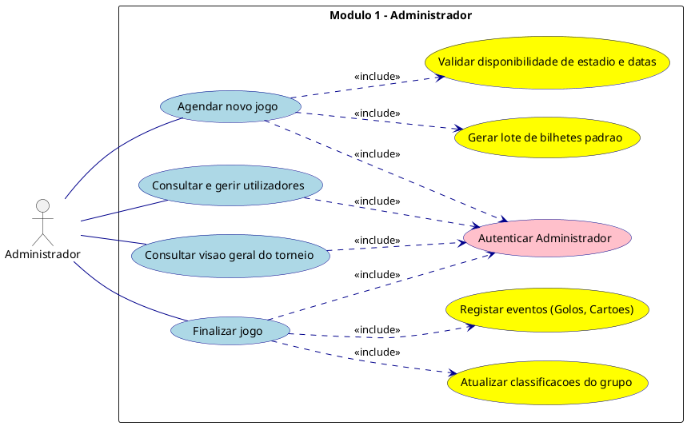

---

## 2. Modulo Gestor de Arbitragem

**Ator:** Gestor de Arbitragem  
**Foco:** Atribuicao de arbitros com validacao estrita de regras FIFA (descanso de 48h e neutralidade de nacionalidade) e avaliacao de desempenho pos-jogo.

### Diagrama Mermaid
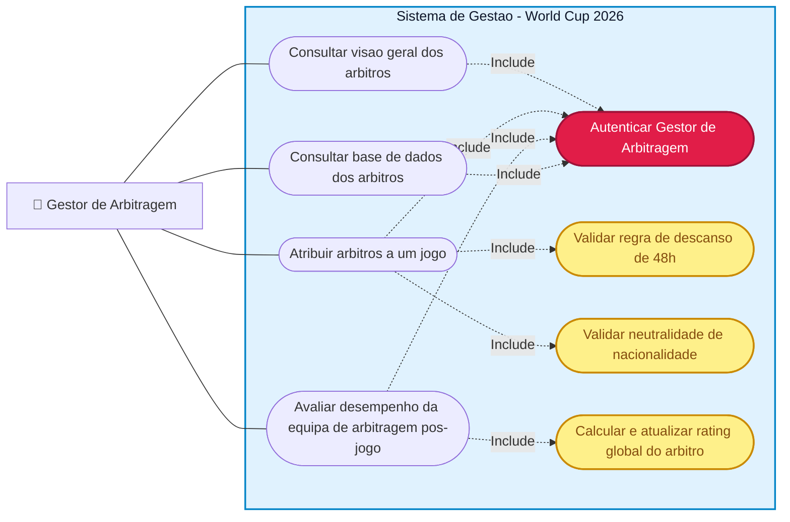

### Codigo PlantUML (Visual Paradigm)
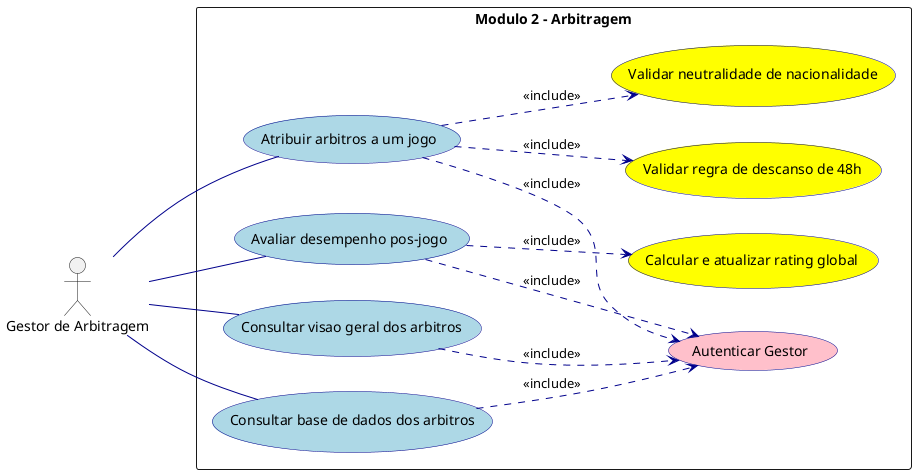

---

## 3. Modulo Gestor de Equipa (Selecionador Nacional)

**Ator:** Gestor de Equipa  
**Foco:** Convocatorias de jogadores com validacao do limite de 26 atletas, escolha dos 11 titulares e consulta de calendario.

### Diagrama Mermaid
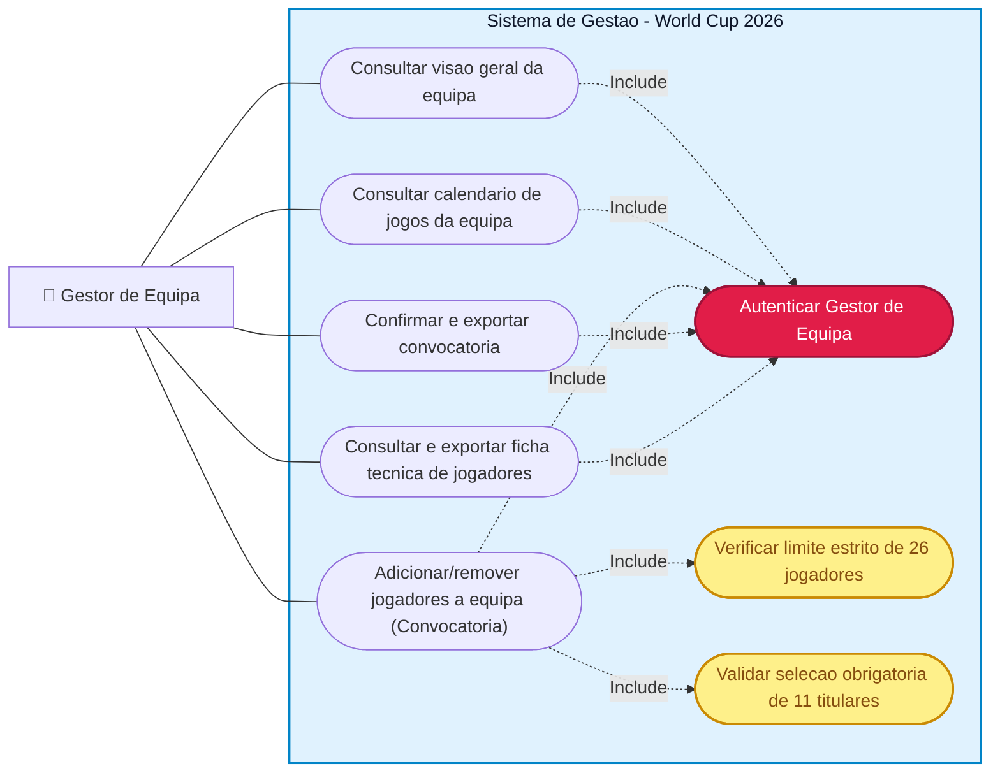

### Codigo PlantUML (Visual Paradigm)
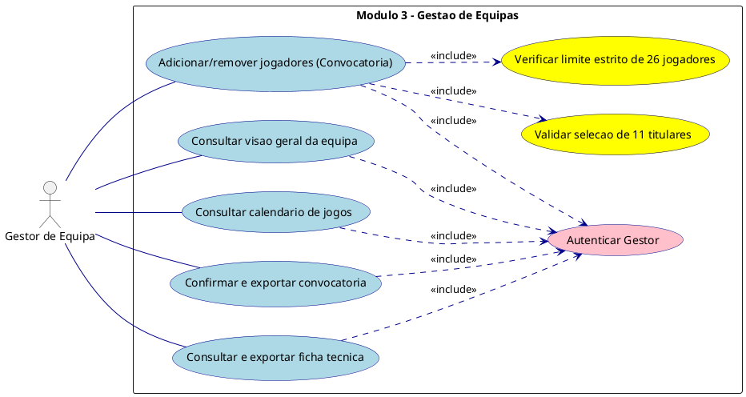

---

## 4. Modulo Gestor de Bilheteira

**Ator:** Gestor de Bilheteira  
**Foco:** Controlo financeiro e comercial dos ingressos, definicao de precos por categoria, inventario e monitorizacao de seguranca contra fraudes.

### Diagrama Mermaid
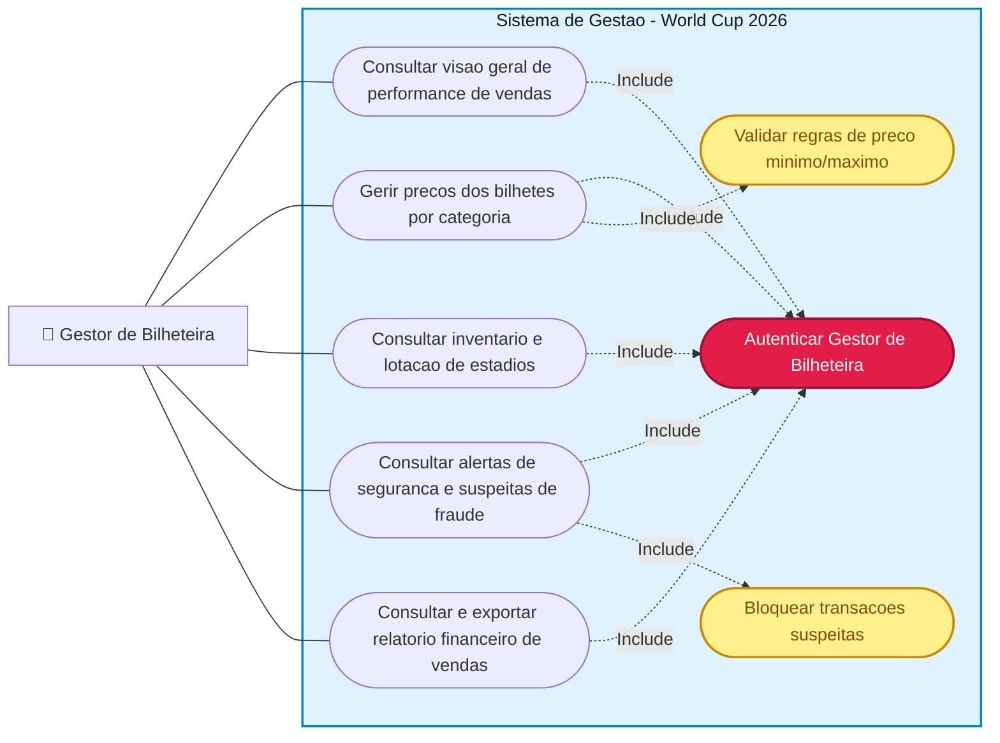

### Codigo PlantUML (Visual Paradigm)
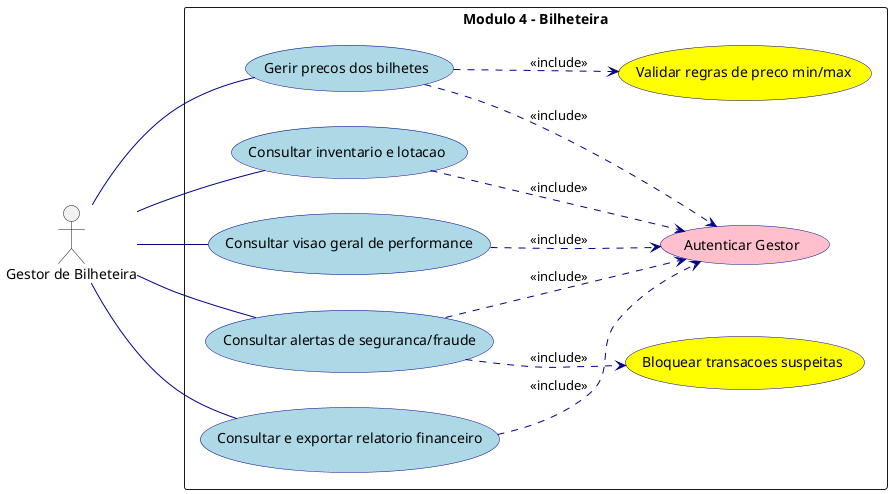

---

## 5. Modulo Gestor de Logistica (Alojamento e Transportes)

**Ator:** Gestor de Logistica  
**Foco:** Alocacao de centros de estagio e hoteis para as selecoes, gestao da frota de autocarros e requisicao de material.

### Diagrama Mermaid
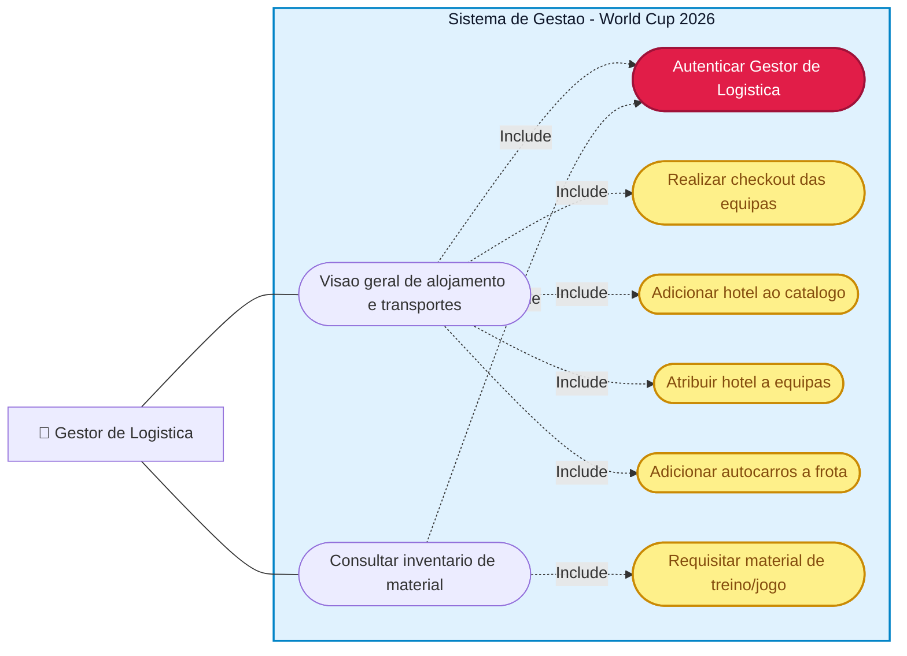

### Codigo PlantUML (Visual Paradigm)
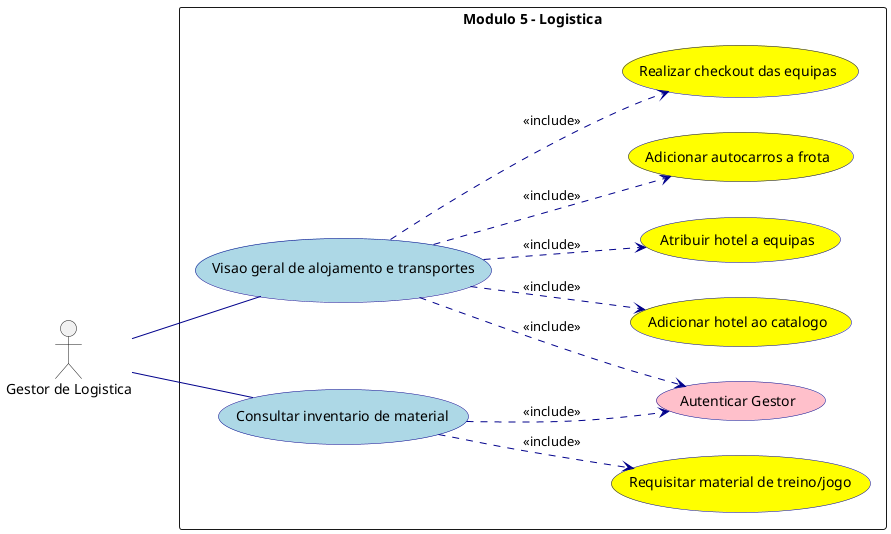

---

## 6. Modulo Cliente Publico (Portal do Adepto)

**Ator:** Cliente Publico  
**Foco:** Consulta de calendarios, visualizacao de tabelas classificativas e aquisicao segura de bilhetes.

### Diagrama Mermaid
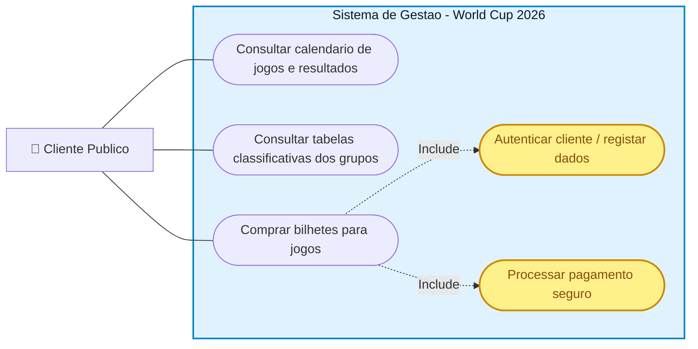

### Codigo PlantUML (Visual Paradigm)
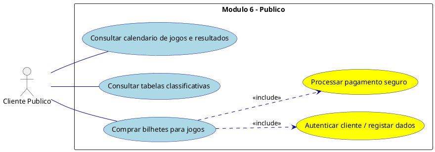

---

## Resumo da Auditoria e Conformidade ICONIX

1. **Fatoracao de Rotinas Comuns (`<<Include>>`):** Todos os modulos garantem que funcionalidades dependentes (como validacao de limites, regras de 48h, seguranca de transacoes e checkout) sao explicitamente modeladas com o relacionamento de inclusao, respeitando a semantica do UML 2.5 e do Slide 23.
2. **Coesao Modular:** A divisao em 6 diagramas isolados permite analisar cada subsistema de forma limpa, direta e profissional.
