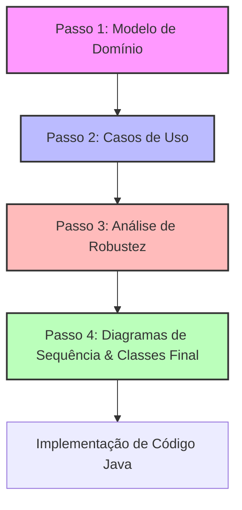

# Metodologia ICONIX no Projeto
## Engenharia de Software – Projeto (Fase 2)

A metodologia **ICONIX** é um processo UML simplificado e focado em ligar os Casos de Uso diretamente ao código. A avaliação da Fase 2 exige o cumprimento rigoroso de regras de desenho e modelação específicas.

---



---

## 🔹 Passo 1 — Domain Modeling (Modelo de Domínio)
- Identificar as classes que representam conceitos do mundo real do campeonato.
- Apenas atributos e associações (com cardinalidades/multiplicidades).
- **Sem métodos** nesta fase inicial.

---

## 🔹 Passo 2 — Use Case Modeling (Casos de Uso)
- Criar o Diagrama de Casos de Uso com Atores bem definidos.
- Escrever as descrições textuais contendo obrigatoriamente:
  - **Caminho Principal (Fluxo Básico):** O fluxo ideal sem erros.
  - **Caminhos Alternativos (Fluxos Alternativos/Exceções):** Condições de erro, falhas e exceções do negócio.

---

## 🔹 Passo 3 — Robustness Analysis (Análise de Robustez)
Para cada caso de uso relevante, criar o Diagrama de Robustez utilizando os estereótipos BCE:
- **Boundary (Fronteira):** Elementos de interface (CLI, menus, ecrãs).
- **Control (Controlo):** Lógica e regras de validação que orquestram o fluxo.
- **Entity (Entidade):** Instâncias das classes do Modelo de Domínio.

### Regras Estritas de Ligação:
- Atores só falam com Boundary.
- Boundary só fala com Control.
- Control fala com Boundary, Entity e outros Control.
- Entity **nunca** fala diretamente com Boundary.

---

## 🔹 Passo 4 — Diagramas de Sequência e Classes Final (Rigor Técnico)

Este passo final traduz o comportamento dinâmico para uma estrutura estática. O docente avaliará o cumprimento estrito das seguintes regras:

### 1. Diagramas de Sequência (Modelação Dinâmica)
* **Linhas de Vida (Lifeline):** Devem estar claramente visíveis sob cada elemento.
* **Focos de Controlo (Focus of Control):** Retângulos sobrepostos na linha de vida que indicam a ativação/execução de um método.
* **Nota Descritiva Lateral:** Deve ser colocada uma nota de texto à esquerda do diagrama indicando os caminhos principais e alternativos representados.
* **Ordem dos Elementos no Topo (Esquerda para a Direita):**
  1. *Descrição/Nota* (na extrema esquerda)
  2. *Ator*
  3. *Objetos Fronteira (Boundary)*
  4. *Objetos de Controlo (Control)* (se aplicável na sequência)
  5. *Objetos Entidade (Entity)*

---

### 2. Diagrama de Classes Final (Modelação Estática)
* **Correspondência Total:** Deve existir uma relação de 1:1 entre as mensagens trocadas no Diagrama de Sequência e os métodos declarados no Diagrama de Classes.
* **Sintaxe Rigorosa dos Atributos:**
  ```
  visibilidade nome [cardinalidade]: tipo = valor_por_omissão {restrições}
  ```
* **Visibilidades UML:** Devem ser corretamente indicadas nos atributos e métodos:
  - `+` : Público (Public)
  - `-` : Privado (Private)
  - `#` : Protegido (Protected)
  - `~` : Módulo/Pacote (Package)
* **Encapsulamento Inteligente:** Não desenhar métodos `get` e `set` genéricos para todos os atributos, a menos que contenham regras/lógica de negócio específicas.
* **Critérios de Qualidade:**
  - **Coesão Forte:** Cada classe deve ter uma única responsabilidade bem definida.
  - **Independência (Baixo Acoplamento):** As classes devem depender o mínimo possível umas das outras para facilitar testes e manutenção.
