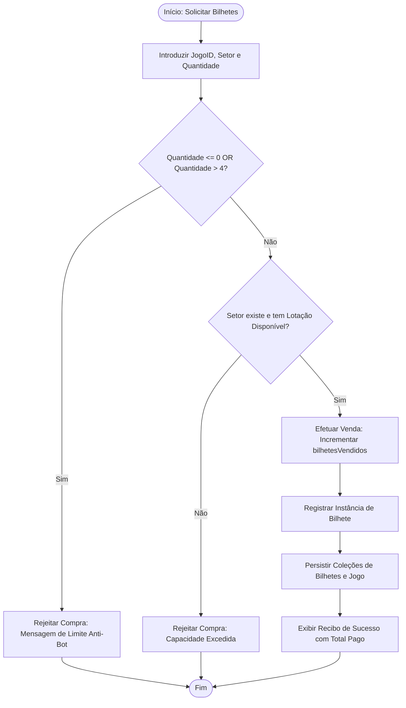
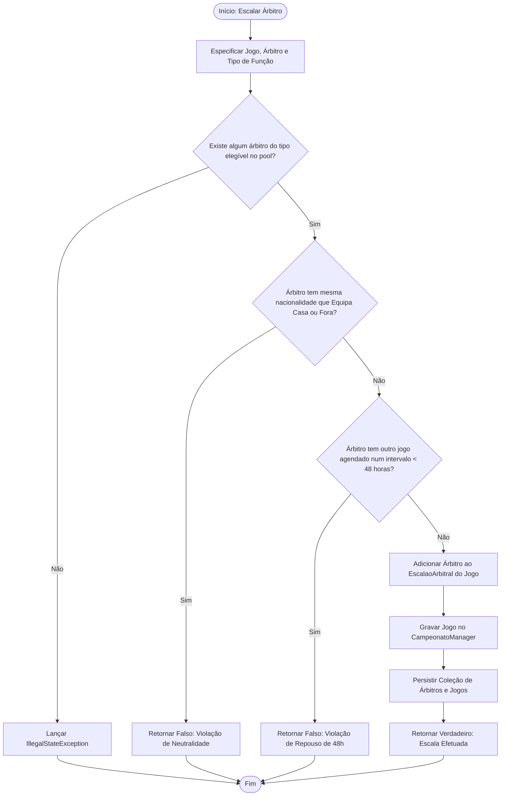
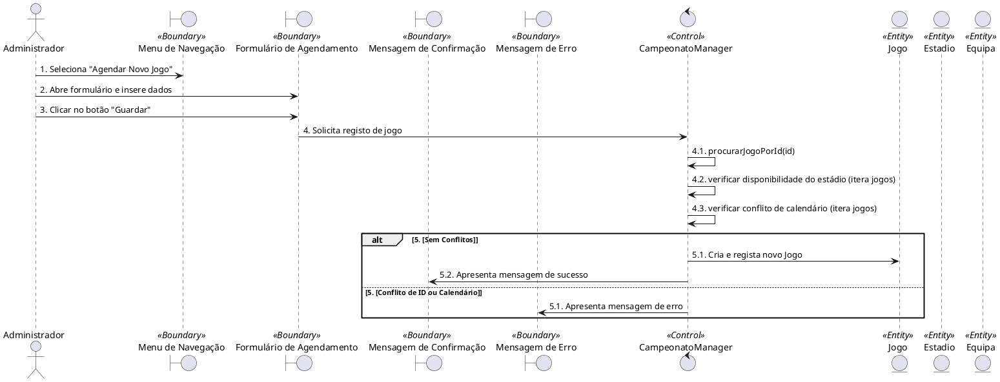
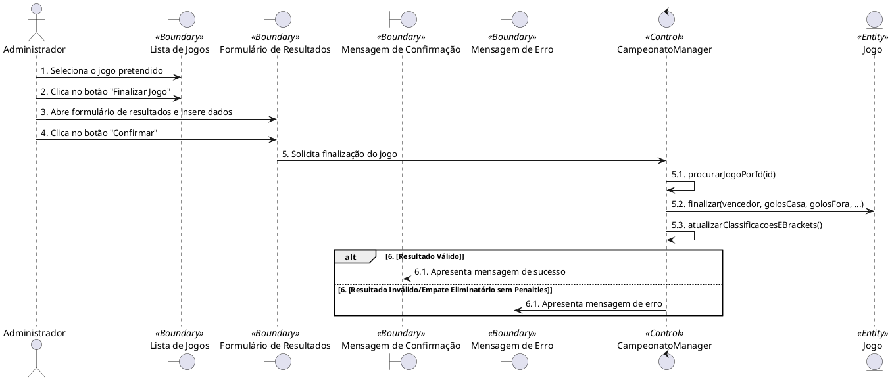
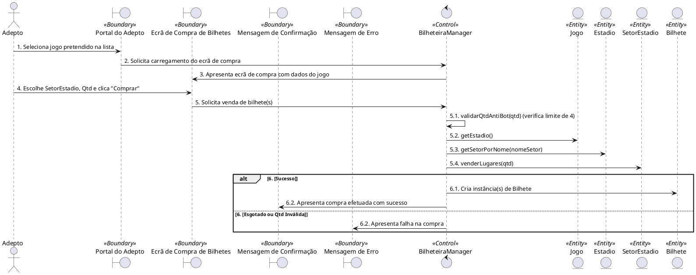
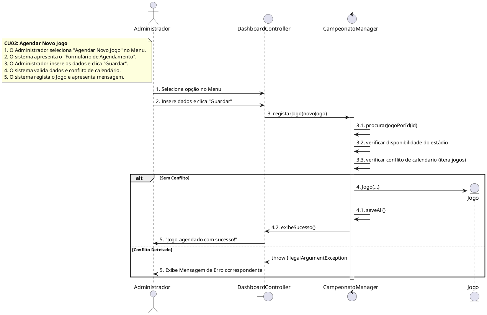
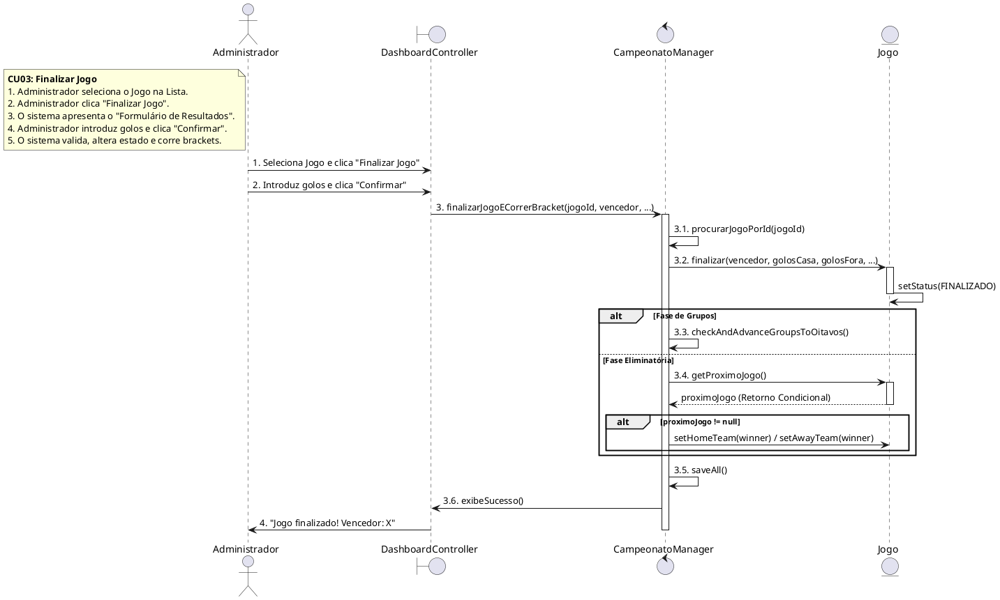
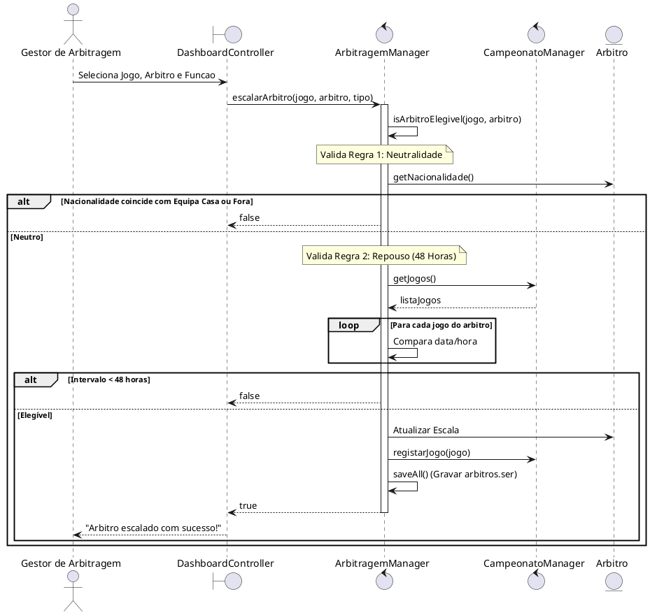
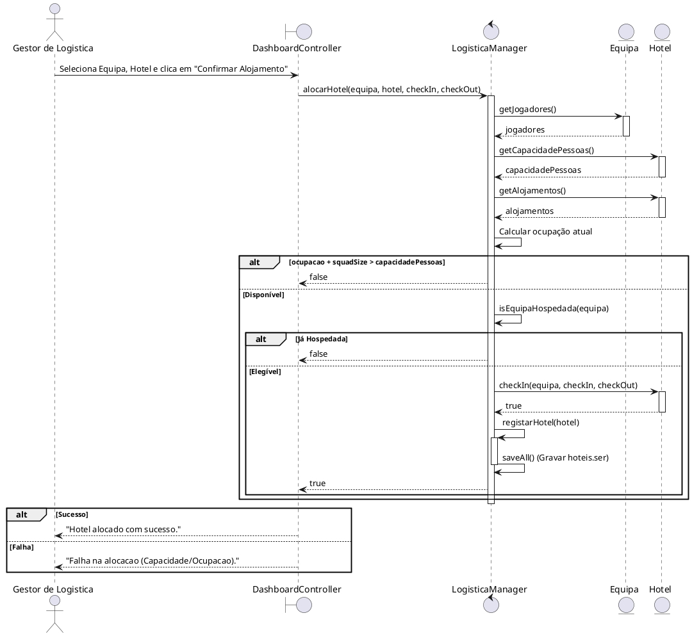
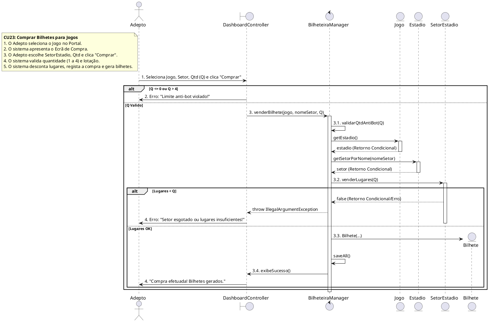

# Diagramas UML para Visual Paradigm (Parte 5)
## Engenharia de Software – Projeto (Fase 2)

Este documento fornece a especificação textual (PlantUML / Sereia e Fluxogramas) dos diagramas de estados e atividades exigidos na Parte 5, prontos para serem modelados no **Visual Paradigm**.

---

## 📌 1. Diagramas de Estados (State Machine Diagrams)

### A. Diagrama de Estados para Jogo
Representa o ciclo de vida de uma partida no campeonato.

```plantuml
@startuml
[*] --> AGENDADO : Criar Jogo (agendarJogo)

state AGENDADO {
    note left of AGENDADO : Escala de árbitros é confidencial\npara o público (Retorna null)
}

AGENDADO --> FINALIZADO : finalizarJogoECorrerBracket()
note on link : Valida resultado + penalties\n(se eliminatória) + avança brackets

state FINALIZADO {
    note right of FINALIZADO : Escala de árbitros e resultado\ntornam-se públicos
}

FINALIZADO --> [*]
@endum
```

* **Transições e Eventos:**
  - `Criar Jogo` -> Transita do estado inicial para `AGENDADO`.
  - `finalizarJogoECorrerBracket()` -> Transita de `AGENDADO` para `FINALIZADO`. As regras de desempate e progressão são aplicadas neste evento.

---

### B. Diagrama de Estados para Bilhete (Setor do Estádio)
Representa a disponibilidade de bilhetes por setor para um determinado jogo.

```plantuml
@startuml
[*] --> DISPONIVEL : Inicializar Setor (capacidadeTotal > 0)

state DISPONIVEL {
    note left of DISPONIVEL : bilhetesVendidos < capacidadeTotal
}

DISPONIVEL --> DISPONIVEL : venderBilhete(qtd)\n[bilhetesVendidos + qtd < capacidadeTotal]

DISPONIVEL --> ESGOTADO : venderBilhete(qtd)\n[bilhetesVendidos + qtd == capacidadeTotal]

state ESGOTADO {
    note right of ESGOTADO : bilhetesVendidos == capacidadeTotal\nNovas vendas são rejeitadas
}

ESGOTADO --> DISPONIVEL : reset() / libertarBilhetes()\n[bilhetesVendidos < capacidadeTotal]
@endum
```

---

### C. Diagrama de Estados para Árbitro
Representa o estado de disponibilidade física e regulamentar do árbitro.

```plantuml
@startuml
[*] --> ATIVO : Registar Árbitro (Estado: ATIVO)

state ATIVO {
    note left of ATIVO : Elegível para escalação\n(se cumprir neutralidade e repouso)
}

ATIVO --> DESCANSO : Jogo Concluído / Escala Concluída\n[refereed match]
note on link : Entra em repouso obrigatório de 48h

state DESCANSO {
    note right of DESCANSO : Inelegível para novos jogos\n(diferença de tempo < 48 horas)
}

DESCANSO --> ATIVO : Tempo Decorrido\n[diferença de tempo >= 48 horas]

ATIVO --> INATIVO : Alterar Estado (Estado: INATIVO)
DESCANSO --> INATIVO : Alterar Estado (Estado: INATIVO)
@endum
```

---

## ⚡ 2. Diagramas de Atividades (Activity Diagrams)

### A. Diagrama de Atividades para Compra de Bilhetes
Modela o fluxo com a validação da regra de negócio de lotação e gate de ética (Anti-Bot).



---

### B. Diagrama de Atividades para Escalação de Árbitros
Modela o fluxo de associação de árbitros com verificação de neutralidade e descanso de 48 horas.



---

## 📌 3. Diagramas de Robustez (Robustness Diagrams - BCE/ICONIX) - Paulo Gomes (50%)

Esta secção contém os diagramas de robustez correspondentes aos Casos de Uso sob responsabilidade de **Paulo Gomes**, respeitando as regras estritas da análise BCE (sem conexões diretas Boundary-Boundary ou Entity-Entity):

### A. CU02 — Agendar Jogo (Responsável: Paulo Gomes)


### B. CU03 — Finalizar Jogo (Responsável: Paulo Gomes)


### C. CU23 — Vender Bilhetes (Responsável: Paulo Gomes / Co-Autor: Arthur)


---

## 🎨 4. Diagramas de Sequência (Sequence Diagrams - BCE/ICONIX)

Estes diagramas seguem a arquitetura **BCE (Boundary-Control-Entity)** / padrão **ICONIX** exigido para a documentação académica. Os diagramas associados ao trabalho de **Paulo Gomes** (CU02, CU03 e CU23) foram corrigidos para alinhar as setas de retorno tracejadas apenas a exceções e incluir notas descritivas. Os diagramas de **Leonardo Mendes** (CU06) e **Arthur** (CU19) mantêm-se inalterados para respeitar a divisão de autoria.

### A. CU02 — Agendar Jogo (Responsável: Paulo Gomes)


### B. CU03 — Finalizar Jogo (Responsável: Paulo Gomes)


### C. CU06 — Escalar Árbitro (Responsável: Leonardo Mendes)


### D. CU19 — Alocar Hotel (Responsável: Arthur)


### E. CU23 — Vender Bilhetes (Responsável: Paulo Gomes / Co-Autor: Arthur)

