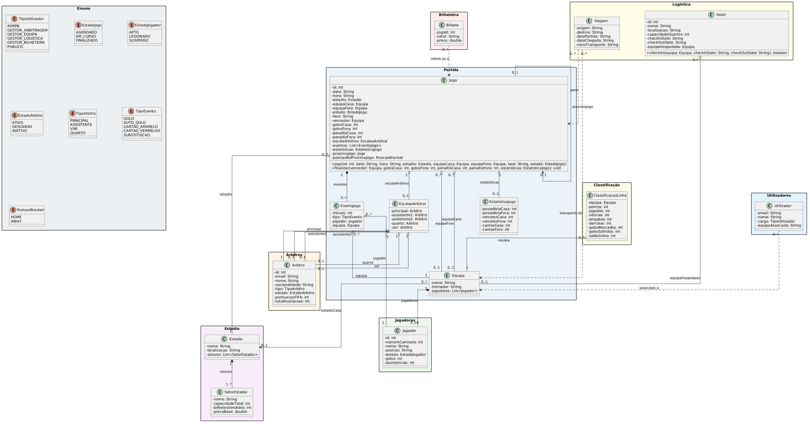
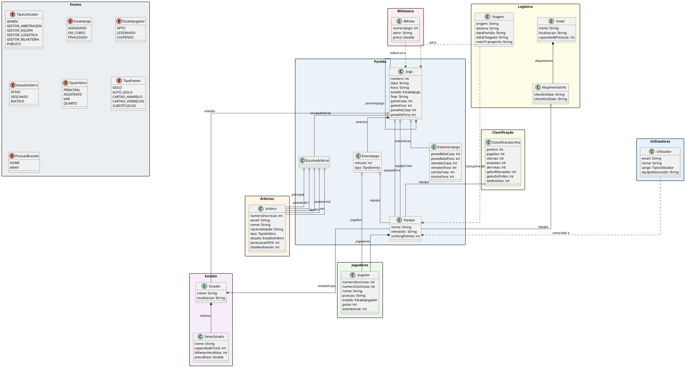

# 8. Modelação Estática (ICONIX)

A modelação estática no processo ICONIX evolui desde a fase de análise de requisitos até ao desenho de detalhe do sistema. Esta secção apresenta esta evolução em dois estágios: o Modelo de Domínio inicial e o Diagrama de Classes de Desenho Final.

> [!NOTE]
> **Nota sobre o Código Java**: A remoção de atributos redundantes nestes diagramas (como coleções e referências que já estão representadas por setas de associação) é uma convenção puramente UML para evitar a duplicação visual de informação no relatório. Esta limpeza gráfica **não altera as classes Java reais** (onde os atributos privados correspondentes são mantidos para implementação).

---

## 8.1. Modelo de Domínio (Passo 1 — Análise)

Este diagrama foca-se exclusivamente nas classes conceptuais do domínio do problema e nas suas relações de negócio puras. 
Conforme as diretrizes das aulas práticas (**Aula 4, pág. 23 - Erro Top 10- nº 1**), este diagrama **não contém cardinalidades** nem **métodos/operações**. Adicionalmente, por se tratar de um modelo conceptual de análise, **não são incluídos marcadores de visibilidade** (+, -, #), os quais são decisões de desenho reservadas para a fase final.

### Código PlantUML do Modelo de Domínio (Conceptual — Sem Métodos, Cardinalidades ou Visibilidades)

---

## 8.2. Diagrama de Classes de Desenho Final (Passo 4 — Desenho)

Este é o diagrama final de implementação, consolidando todas as assinaturas de métodos, cardinalidades e marcadores de visibilidade descobertos na modelação dinâmica (diagramas de sequência) e refletindo a estrutura final do código Java.

### Código PlantUML do Diagrama de Classes de Desenho (Com Métodos, Cardinalidades e Visibilidades)

```plantuml
@startuml
skinparam classAttributeIconSize 0
skinparam packageStyle rectangle
skinparam linetype ortho
skinparam nodesep 100
skinparam ranksep 80

package "Partida" #EBF3F9 {
    class Jogo {
        - id: int
        - data: String
        - hora: String
        - estado: EstadoJogo
        - fase: String
        - golosCasa: int
        - golosFora: int
        - penaltisCasa: int
        - penaltisFora: int
        + Jogo(id: int, data: String, hora: String, estadio: Estadio, equipaCasa: Equipa, equipaFora: Equipa, fase: String, estado: EstadoJogo)
        + finalizar(vencedor: Equipa, golosCasa: int, golosFora: int, penaltisCasa: int, penaltisFora: int, estatisticas: EstatisticaJogo): void
    }

    class Equipa {
        - nome: String
        - treinador: String
        - rankingPontos: int
    }

    class EscalaoArbitral {
        + EscalaoArbitral(principal: Arbitro, assistente1: Arbitro, assistente2: Arbitro, quarto: Arbitro, var: Arbitro)
    }

    class EventoJogo {
        - minuto: int
        - tipo: TipoEvento
        + EventoJogo(minuto: int, tipo: TipoEvento, jogador: Jogador, equipa: Equipa)
    }

    class EstatisticaJogo {
        - posseBolaCasa: int
        - posseBolaFora: int
        - rematesCasa: int
        - rematesFora: int
        - cantosCasa: int
        - cantosFora: int
        + EstatisticaJogo(posseCasa: int, posseFora: int, rematesCasa: int, rematesFora: int, cantosCasa: int, cantosFora: int)
    }
}

package "Jogadores" #EDF7ED {
    class Jogador {
        - id: int
        - numeroCamisola: int
        - nome: String
        - posicao: String
        - estado: EstadoJogador
        - golos: int
        - assistencias: int
        + Jogador(id: int, numeroCamisola: int, nome: String, posicao: String)
        + marcarGolo(): void
        + adicionarAssistencia(): void
    }
}

package "Árbitros" #FFF4E5 {
    class Arbitro {
        - id: int
        - email: String
        - nome: String
        - nacionalidade: String
        - tipo: TipoArbitro
        - estado: EstadoArbitro
        - pontuacaoFIFA: int
        - totalAvaliacoes: int
        + Arbitro(id: int, email: String, nome: String, nacionalidade: String, tipo: TipoArbitro)
        + atualizarAvaliacao(novaNota: int): void
    }
}

package "Estádio" #F6EDF9 {
    class Estadio {
        - nome: String
        - localizacao: String
        + Estadio(nome: String, localizacao: String)
    }

    class SetorEstadio {
        - nome: String
        - capacidadeTotal: int
        - bilhetesVendidos: int
        - precoBase: double
        + SetorEstadio(nome: String, capacidade: int, precoBase: double)
        + venderLugares(qtd: int): boolean
    }
}

package "Bilheteira" #FDEDED {
    class Bilhete {
        - jogoId: int
        - setor: String
        - preco: double
        + Bilhete(jogoId: int, setor: String, preco: double)
    }
}

package "Logística" #FFFDE7 {
    class Hotel {
        - id: int
        - nome: String
        - localizacao: String
        - capacidadePessoas: int
        + Hotel(id: int, nome: String, localizacao: String, capacidadePessoas: int)
        + checkIn(equipa: Equipa, checkInDate: String, checkOutDate: String): boolean
        + checkOutEquipa(equipa: Equipa): boolean
        + checkOut(): void
    }

    class AlojamentoInfo {
        - checkInDate: String
        - checkOutDate: String
        + AlojamentoInfo(equipa: Equipa, checkInDate: String, checkOutDate: String)
    }

    class Viagem {
        - origem: String
        - destino: String
        - dataPartida: String
        - dataChegada: String
        - meioTransporte: String
        + Viagem(origem: String, destino: String, dataPartida: String, dataChegada: String, meio: String)
    }
}

package "Utilizadores" #E3F2FD {
    class Utilizador {
        - email: String
        - nome: String
        - cargo: TipoUtilizador
        - equipaAssociada: String
        + Utilizador(email: String, nome: String, cargo: TipoUtilizador)
    }
}

package "Classificação" #F9FBE7 {
    class ClassificacaoLinha {
        - pontos: int
        - jogados: int
        - vitorias: int
        - empates: int
        - derrotas: int
        - golosMarcados: int
        - golosSofridos: int
        - saldoGolos: int
        + ClassificacaoLinha(equipa: Equipa)
        + registarPartida(golosMarcados: int, golosSofridos: int): void
    }
}

package "Enums" #ECEFF1 {
    enum TipoUtilizador {
        ADMIN
        GESTOR_ARBITRAGEM
        GESTOR_EQUIPA
        GESTOR_LOGISTICA
        GESTOR_BILHETEIRA
        PUBLICO
    }

    enum EstadoJogo {
        AGENDADO
        EM_CURSO
        FINALIZADO
    }

    enum EstadoJogador {
        APTO
        LESIONADO
        SUSPENSO
    }

    enum EstadoArbitro {
        ATIVO
        DESCANSO
        INATIVO
    }

    enum TipoArbitro {
        PRINCIPAL
        ASSISTENTE
        VAR
        QUARTO
    }

    enum TipoEvento {
        GOLO
        AUTO_GOLO
        CARTAO_AMARELO
        CARTAO_VERMELHO
        SUBSTITUICAO
    }

    enum PosicaoBracket {
        HOME
        AWAY
    }
}

' Relacionamentos com cardinalidades rigorosas de Desenho
Jogo "0..*" o-- "0..1" Equipa : equipaCasa
Jogo "0..*" o-- "0..1" Equipa : equipaFora
Jogo "0..*" o-- "1" Estadio : estadio
Jogo "1" o-- "0..1" EscalaoArbitral : escalaArbitros
Jogo "1" *-- "0..*" EventoJogo : eventos
Jogo "1" o-- "0..1" EstatisticaJogo : estatisticas
Jogo "0..1" --> "0..1" Jogo : proximoJogo

Equipa "1" *-- "0..26" Jogador : jogadores
Equipa "0..*" --> "0..1" Estadio : estadioCasa

EscalaoArbitral "1" o-- "1" Arbitro : principal
EscalaoArbitral "1" o-- "0..1" Arbitro : assistente1
EscalaoArbitral "1" o-- "0..1" Arbitro : assistente2
EscalaoArbitral "1" o-- "0..1" Arbitro : quarto
EscalaoArbitral "1" o-- "0..1" Arbitro : var

Estadio "1" *-- "1..*" SetorEstadio : setores

Bilhete "0..*" ..> Jogo : refere-se a

Hotel "1" *-- "0..*" AlojamentoInfo : alojamentos
AlojamentoInfo "0..*" o-- "1" Equipa : equipa
Viagem "0..*" ..> Equipa : transporte de
Viagem "0..*" ..> Jogo : para

Utilizador "0..*" ..> Equipa : associado a

EventoJogo "0..*" o-- "1" Jogador : jogador
EventoJogo "0..*" o-- "1" Equipa : equipa

ClassificacaoLinha "0..*" o-- "1" Equipa : equipa
@enduml
```

