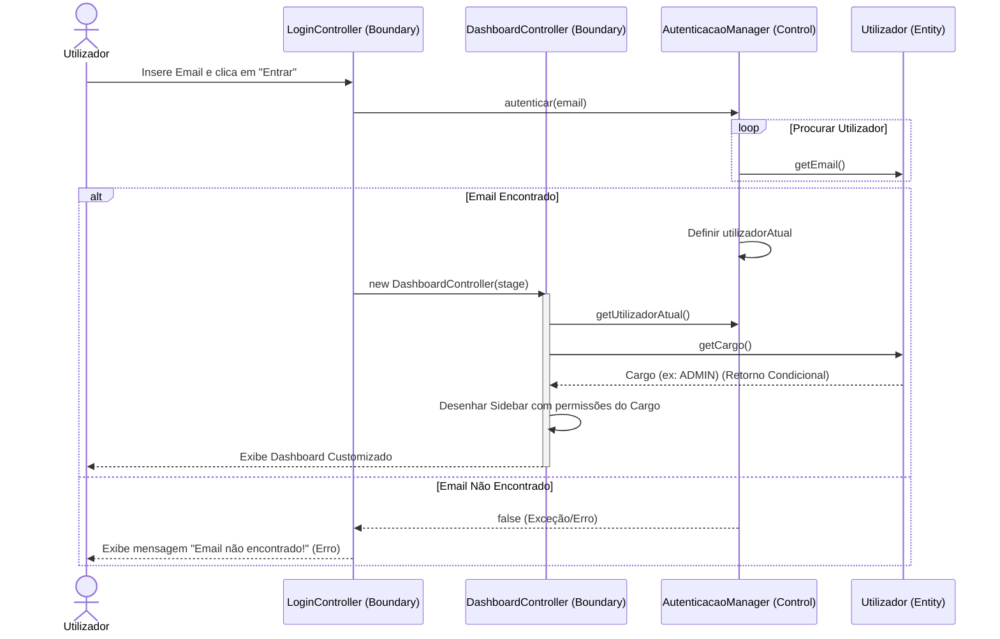
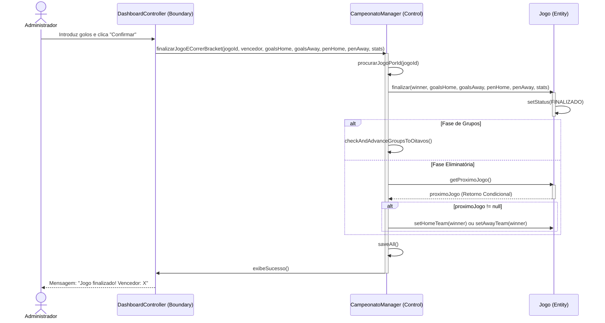
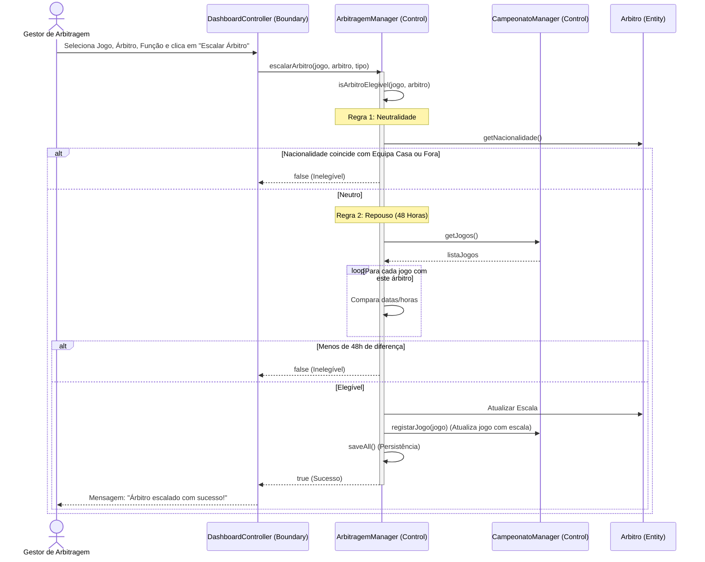
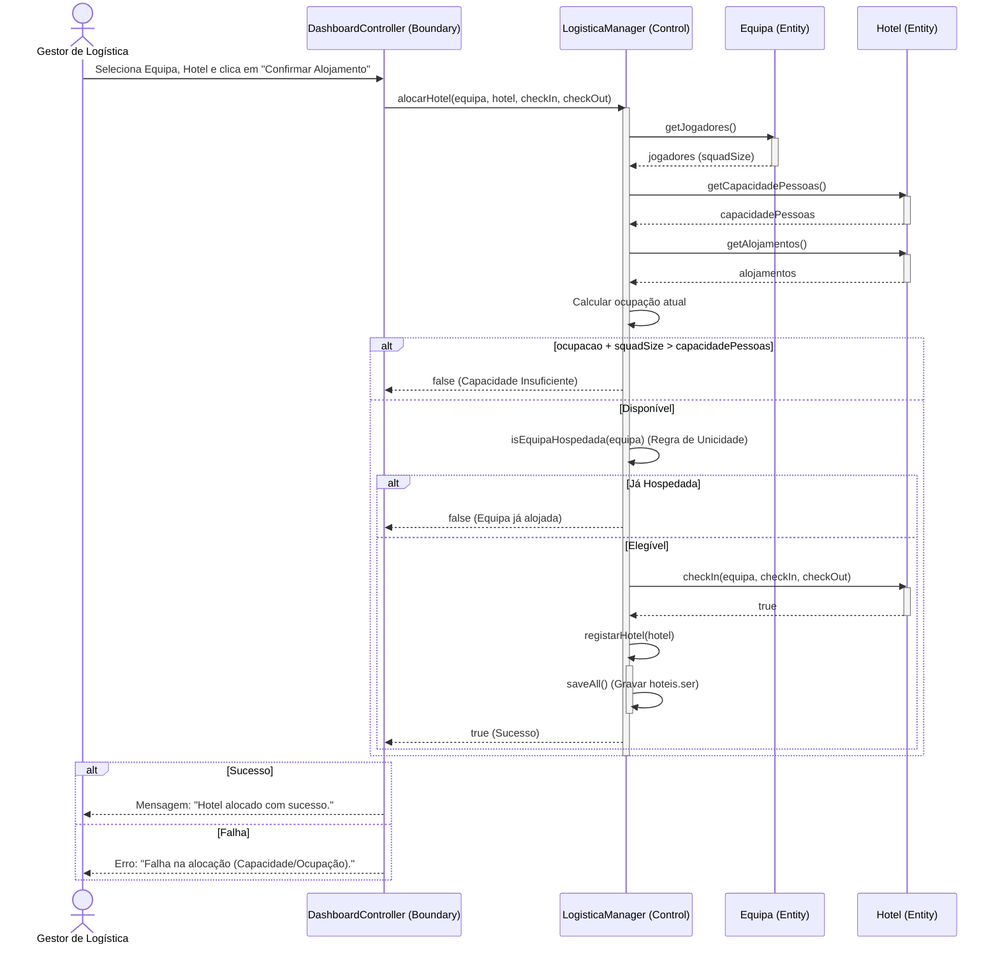

# Diagramas de Sequência em Mermaid — Gestão WC 2026

Estes diagramas replicam a estrutura **BCE (Boundary-Control-Entity)** / padrão **ICONIX** exigido para o projeto, em formato **Mermaid** para visualização interativa diretamente no GitHub ou editores compatíveis com Markdown.

> [!NOTE]
> **Convenção de Retornos em Sequência**: Para as partes de **Paulo Gomes** (CU02, CU03, CU23), as setas tracejadas (`-->>`) são suprimidas em retornos normais implícitos de sucesso, sendo desenhadas apenas em caso de exceções/erros ou retornos condicionais. As partes dos restantes membros do grupo mantêm-se inalteradas.

---

### 1. Login & RBAC (Roteamento Dinâmico) - Responsável: Paulo Gomes


---

### 2. CU02 — Agendar Jogo - Responsável: Paulo Gomes
```mermaid
sequenceDiagram
    actor A as Administrador
    participant B as DashboardController (Boundary)
    participant C as CampeonatoManager (Control)
    participant J as Jogo (Entity)

    A->>B: Insere dados e clica "Guardar"
    B->>C: registarJogo(novoJogo)
    activate C
    C->>C: procurarJogoPorId(id)
    C->>C: verificar disponibilidade do estádio
    C->>C: verificar conflito de calendário (itera jogos)
    alt Sem Conflito
        create J
        C->>J: Jogo(...)
        C->>C: saveAll()
        C->>B: exibeSucesso()
        B-->>A: "Jogo agendado com sucesso!"
    else Conflito Detetado
        C-->>B: throw IllegalArgumentException (Erro)
        B-->>A: Exibe mensagem de erro correspondente
    end
    deactivate C
```

---

### 3. CU03 — Finalizar Jogo & Brackets - Responsável: Paulo Gomes


---

### 4. CU06 — Escalar Árbitro (Neutralidade e Repouso) - Responsável: Leonardo Mendes


---

### 5. CU19 — Alocar Hotel (Logística) - Responsável: Arthur


---

### 6. CU23 — Compra de Bilhete com Regra Anti-Bot - Responsável: Paulo Gomes / Co-Autor: Arthur
```mermaid
sequenceDiagram
    actor P as Público / Adepto
    participant B as DashboardController (Boundary)
    participant C as BilheteiraManager (Control)
    participant J as Jogo (Entity)
    participant E as Estadio (Entity)
    participant S as SetorEstadio (Entity)
    participant Bi as Bilhete (Entity)

    P->>B: Seleciona Jogo, Setor, Quantidade (Q) e clica "Comprar"
    alt Q <= 0 ou Q > 4
        B-->>P: Erro: "Limite máximo de compra de 4 bilhetes..."
    else Q Válido (1 a 4)
        B->>C: venderBilhete(jogo, nomeSetor, Q)
        activate C
        C->>C: validarQtdAntiBot(Q)
        C->>J: getEstadio()
        activate J
        J-->>C: estadio (Retorno Condicional)
        deactivate J
        C->>E: getSetorPorNome(nomeSetor)
        activate E
        E-->>C: setor (Retorno Condicional)
        deactivate E
        C->>S: venderLugares(Q)
        activate S
        alt Lugares < Q
            S-->>C: false (Retorno Condicional/Erro)
            C-->>B: throw IllegalArgumentException (Erro)
            B-->>P: Erro: "Setor esgotado ou lugares insuficientes!"
        else Lugares OK
            deactivate S
            create Bi
            C->>Bi: Bilhete(...)
            C->>C: saveAll()
            C->>B: exibeSucesso()
            B-->>P: Mensagem: "Compra efetuada com sucesso!"
        end
    end
    deactivate C
```
