# Diagrama de Classes Detalhado (Parte 5)
## Engenharia de Software – Projeto (Fase 2)

Este documento fornece a especificação textual em formato **PlantUML** do Diagrama de Classes final da aplicação, representando a correspondência exata 1 para 1 com as classes de domínio (`domain`) e gestores de lógica (`manager`) implementadas na aplicação Java.

---

## 📌 Código PlantUML do Diagrama de Classes

Pode copiar o código abaixo para o **Visual Paradigm** (através de *More > Lab > Insert PlantUML Diagram...*) ou site online como [PlantUML](http://www.plantuml.com/plantuml) para gerar visualmente a estrutura de classes:

```plantuml
@startuml
skinparam classAttributeIconSize 0

package domain {
    enum TipoUtilizador {
        ADMIN
        GESTOR_ARBITRAGEM
        GESTOR_EQUIPA
        GESTOR_LOGISTICA
        GESTOR_BILHETEIRA
        PUBLICO
    }
    
    enum StatusJogo {
        AGENDADO
        FINALIZADO
    }

    enum EstadoJogador {
        APTO
        LESIONADO
        SUSPENSO
    }

    enum EstadoArbitro {
        ATIVO
        DESCANSO
        INATIVO
    }

    enum TipoArbitro {
        PRINCIPAL
        ASSISTENTE
        QUARTO_ARBITRO
        VAR
    }

    enum TipoEvento {
        GOLO
        CARTAO_AMARELO
        CARTAO_VERMELHO
        SUBSTITUICAO
    }

    enum PosicaoBracket {
        HOME
        AWAY
    }

    class Utilizador {
        -String email
        -String nome
        -TipoUtilizador cargo
        -String equipaAssociada
        +getEmail(): String
        +getNome(): String
        +getCargo(): TipoUtilizador
        +getEquipaAssociada(): String
    }

    class Jogador {
        -int id
        -int numeroCamisola
        -String nome
        -String posicao
        -EstadoJogador estado
        -int energia
        -boolean titular
        -int golos
        -int assistencias
        -int cartoesAmarelos
        -int cartoesVermelhos
        -int minutosJogados
        +updateStats(goals: int, assists: int, yellow: int, red: int, mins: int): void
        +recuperarEnergia(amount: int): void
    }

    class Equipa {
        -String nome
        -String treinador
        -List<Jogador> jogadores
        +adicionarJogador(j: Jogador): boolean
        +removerJogador(id: int): boolean
        +getJogadores(): List<Jogador>
    }

    class Jogo {
        -int id
        -String data
        -String hora
        -Estadio estadio
        -String phase
        -StatusJogo status
        -Equipa homeTeam
        -Equipa awayTeam
        -int goalsHome
        -int goalsAway
        -int penaltiesHome
        -int penaltiesAway
        -Equipa winner
        -boolean evaluated
        -EstatisticaJogo stats
        -List<EventoJogo> events
        -EscalaoArbitral escala
        -Jogo proximoJogo
        -PosicaoBracket posicaoNoProximoJogo
        +finalizar(winner: Equipa, gh: int, ga: int, ph: int, pa: int, stats: EstatisticaJogo): void
    }

    class Estadio {
        -String nome
        -String cidade
        -List<SetorEstadio> setores
        +getSetorPorNome(nome: String): SetorEstadio
    }

    class SetorEstadio {
        -String nome
        -int capacidadeTotal
        -int bilhetesVendidos
        +venderBilhete(qtd: int): boolean
        +reset(): void
    }

    class Bilhete {
        -int id
        -Jogo jogo
        -String setor
        -double preco
        +getId(): int
        +getJogo(): Jogo
        +getSetor(): String
        +getPreco(): double
    }

    class Arbitro {
        -int id
        -String nome
        -String nacionalidade
        -TipoArbitro tipo
        -EstadoArbitro estado
        -long ultimoJogoTimestamp
        -int matchesRefereed
        -double fifaScore
        -double fifaSum
        -int evaluationsCount
        +avaliarDesempenho(estrelas: int): void
        +resetPontuacoes(): void
    }

    class EscalaoArbitral {
        -Arbitro principal
        -Arbitro assistente1
        -Arbitro assistente2
        -Arbitro quartoArbitro
        -Arbitro var
        +getPrincipal(): Arbitro
        +getAssistente1(): Arbitro
    }

    class EventoJogo {
        -TipoEvento tipo
        -int minuto
        -Jogador jogador
        -Equipa equipa
    }

    class EstatisticaJogo {
        -int possessionHome
        -int totalShotsHome
        -int totalShotsAway
        -int cornersHome
        -int cornersAway
        -int foulsHome
        -int foulsAway
        -int passesHome
        -int passesAway
        +getPossessionHome(): int
    }

    class Viagem {
        -String origem
        -String destino
        -String dataPartida
        -String dataChegada
        -String meioTransporte
    }

    class Hotel {
        -int id
        -String nome
        -String localizacao
        -int capacidadeQuartos
        -Equipa equipaHospedada
        -String dataCheckIn
        -String dataCheckOut
        +checkIn(equipa: Equipa, in: String, out: String): boolean
        +checkOut(): void
    }
}

package manager {
    class AutenticacaoManager {
        -static AutenticacaoManager instance
        -List<Utilizador> utilizadores
        +getInstance(): AutenticacaoManager
        +autenticar(email: String): boolean
        +getUtilizadorAtual(): Utilizador
    }

    class CampeonatoManager {
        -static CampeonatoManager instance
        -List<Jogo> jogos
        -List<Equipa> equipas
        -List<Estadio> estadios
        -Map<String, List<String>> grupos
        +getInstance(): CampeonatoManager
        +registarJogo(j: Jogo): void
        +finalizarJogoECorrerBracket(id: int, winner: Equipa, gh: int, ga: int, ph: int, pa: int, stats: EstatisticaJogo): void
        +calcularClassificacaoGrupo(grupo: String): List<ClassificacaoLinha>
    }

    class ArbitragemManager {
        -static ArbitragemManager instance
        -List<Arbitro> arbitros
        +getInstance(): ArbitragemManager
        +escalarArbitro(jogo: Jogo, arbitro: Arbitro, funcao: TipoArbitro): boolean
        +isArbitroElegivel(jogo: Jogo, arbitro: Arbitro): boolean
    }

    class LogisticaManager {
        -static LogisticaManager instance
        -List<Hotel> hoteis
        -List<Viagem> viagens
        +getInstance(): LogisticaManager
        +alocarHotel(equipa: Equipa, hotel: Hotel, in: String, out: String): boolean
        +registarCheckout(hotel: Hotel): void
        +planearViagem(j: Jogo, o: String, d: String, dp: String, dc: String, m: String): Viagem
    }

    class BilheteiraManager {
        -static BilheteiraManager instance
        -List<Bilhete> bilhetes
        +getInstance(): BilheteiraManager
        +venderBilhete(jogo: Jogo, setor: String, qtd: int): boolean
    }
}

Equipa "1" *-- "0..26" Jogador
Estadio "1" *-- "1..*" SetorEstadio
Jogo "1" o-- "1" Estadio
Jogo "1" o-- "0..2" Equipa
Jogo "1" *-- "1" EscalaoArbitral
Jogo "1" *-- "0..*" EventoJogo
Jogo "1" *-- "1" EstatisticaJogo
EscalaoArbitral "1" o-- "0..5" Arbitro
Bilhete "0..*" o-- "1" Jogo
Hotel "1" o-- "0..1" Equipa
Utilizador "1" o-- "1" TipoUtilizador
Jogador "1" o-- "1" EstadoJogador
Arbitro "1" o-- "1" TipoArbitro
Arbitro "1" o-- "1" EstadoArbitro
EventoJogo "1" o-- "1" TipoEvento
EventoJogo "1" o-- "1" Jogador
EventoJogo "1" o-- "1" Equipa
@endum
```

---

## 💡 Relações e Estruturas UML
* **Composição (`*--`):** Usada para relações onde o ciclo de vida da parte depende do todo (ex: `Equipa ↔ Jogador`, `Estadio ↔ SetorEstadio`, `Jogo ↔ EstatisticaJogo`).
* **Associação/Agregação (`o--`):** Usada para conexões mais fracas ou referências partilhadas (ex: `Jogo ↔ Estadio`, `Jogo ↔ Equipa`, `Hotel ↔ Equipa`).
* **Tipagem Genérica:** Coleções Java como `List<Jogador>` estão especificadas para manter correspondência direta com o código Java implementado.
