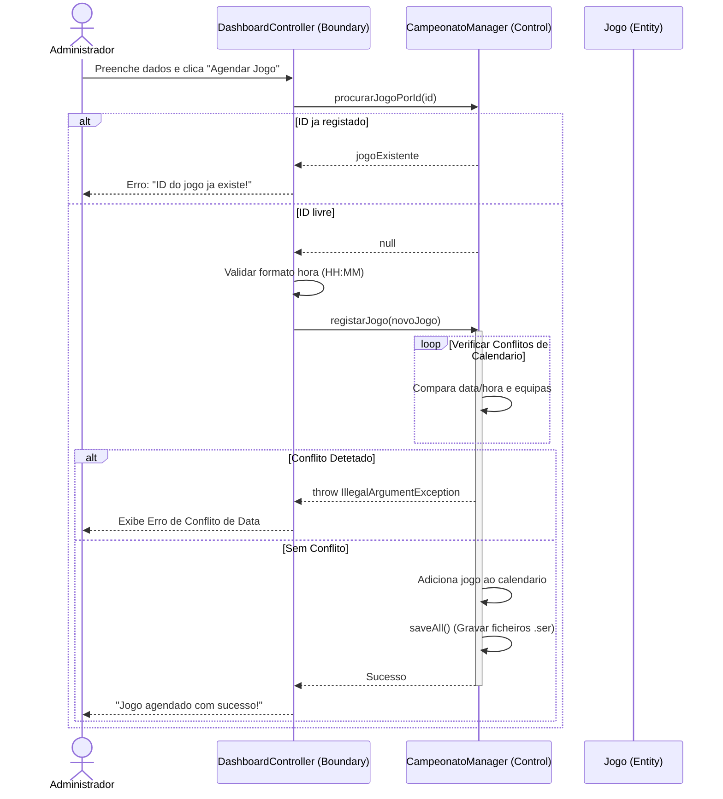
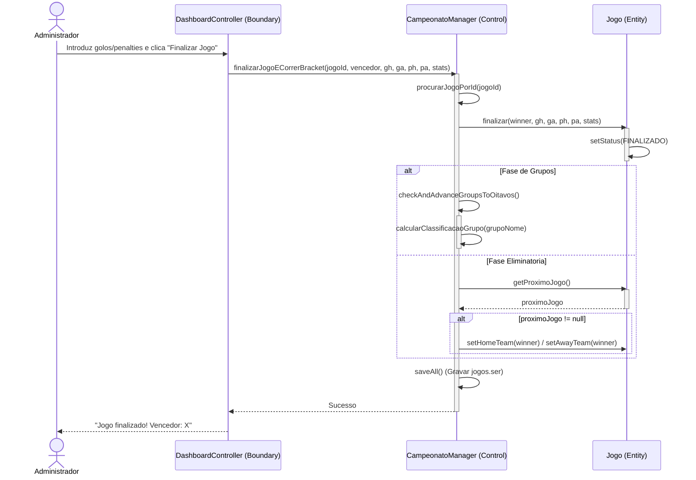
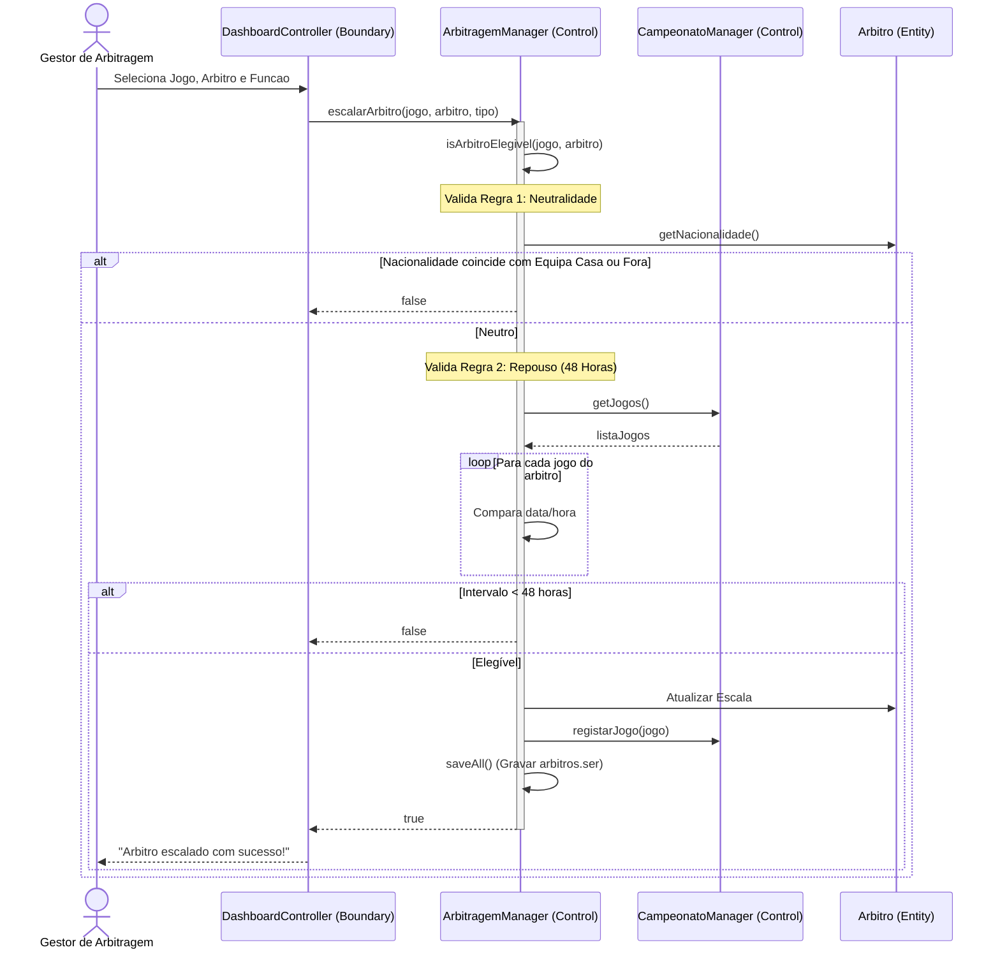
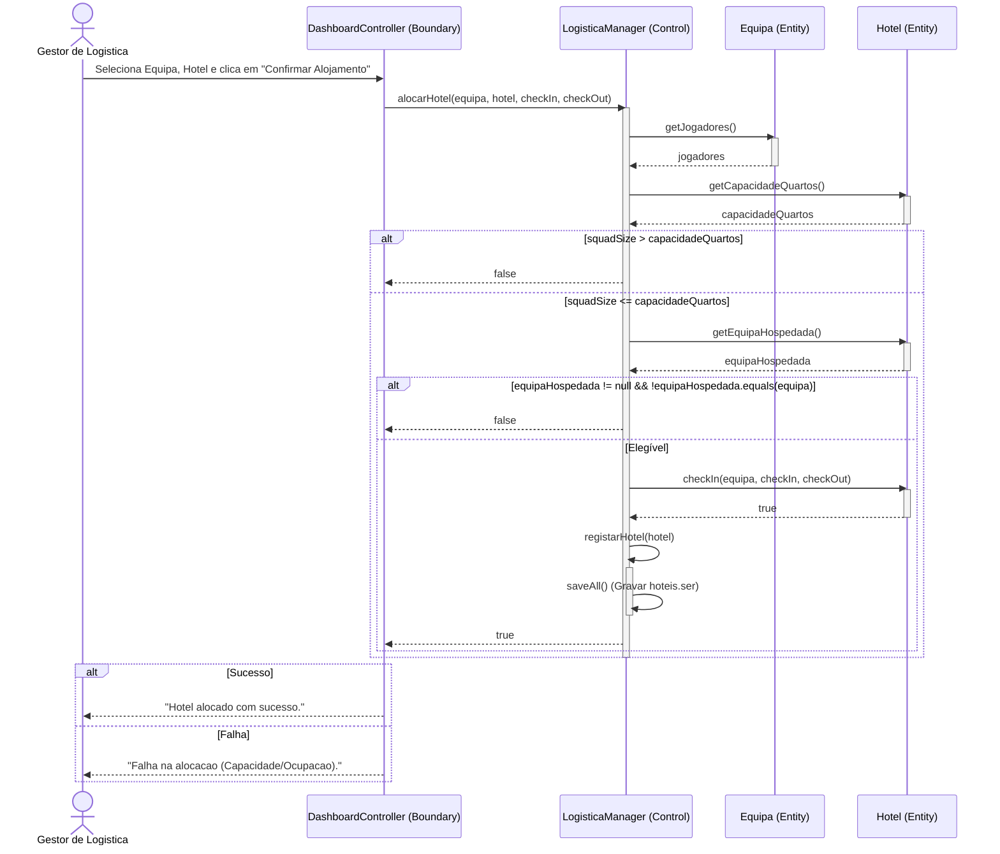
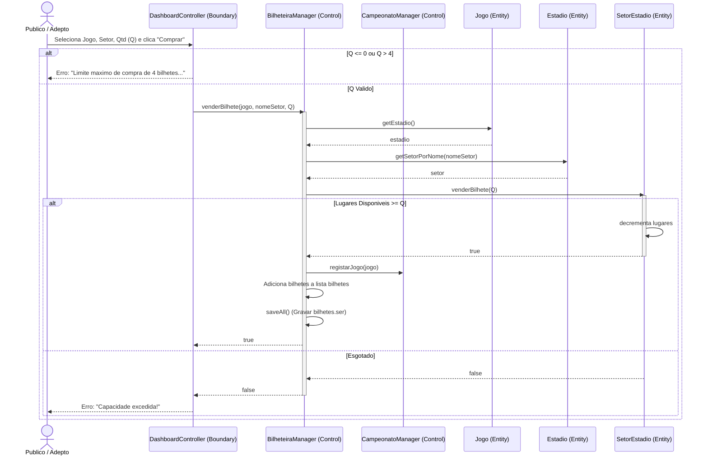

# Diagramas de Sequência BCE em Mermaid (Visualização Live)
## Engenharia de Software – Projeto (Fase 2)

Este documento contém a representação visual dos diagramas de sequência no formato **Mermaid**. O GitHub e visualizadores de Markdown compatíveis renderizam estes blocos diretamente como diagramas interativos.

Estes diagramas seguem a arquitetura **BCE (Boundary-Control-Entity)** do padrão **ICONIX**:
* **Boundary**: Controladores de interface (`DashboardController`).
* **Control**: Managers de lógica (`CampeonatoManager`, `ArbitragemManager`, `LogisticaManager`, `BilheteiraManager`).
* **Entity**: Entidades de dados (`Jogo`, `Arbitro`, `Equipa`, `Hotel`, `SetorEstadio`, `Bilhete`).

---

### 1. CU02 — Agendar Jogo

---

### 2. CU03 — Finalizar Jogo (Corrigido)

---

### 3. CU06 — Escalar Árbitro

---

### 4. CU19 — Alocar Hotel

---

### 5. CU23 — Vender Bilhetes

