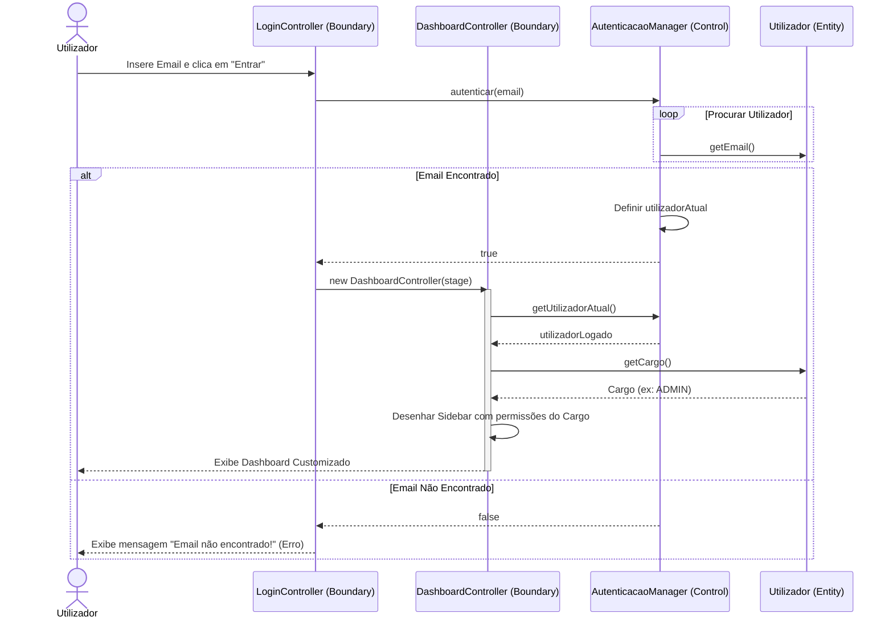
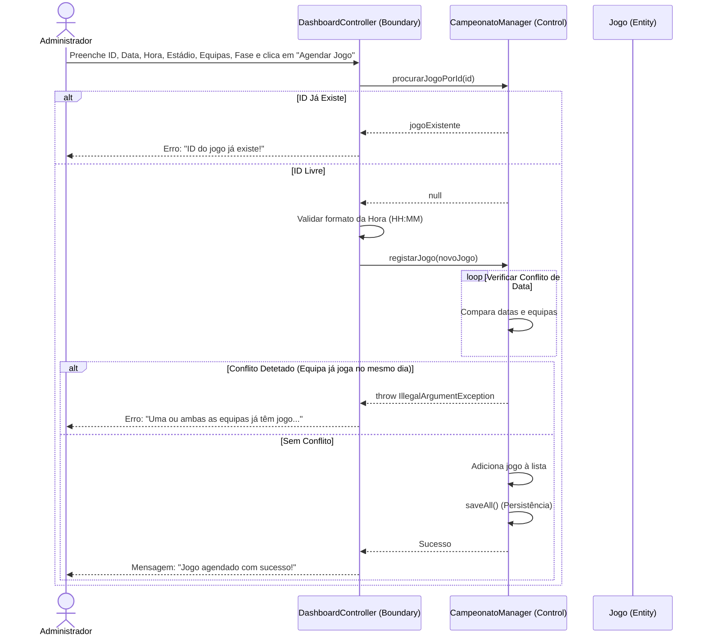
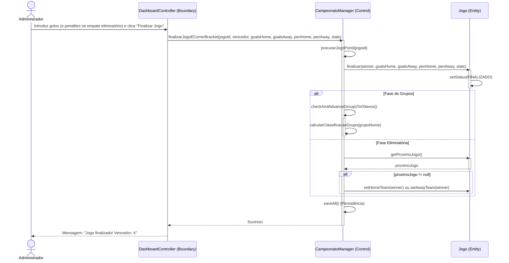
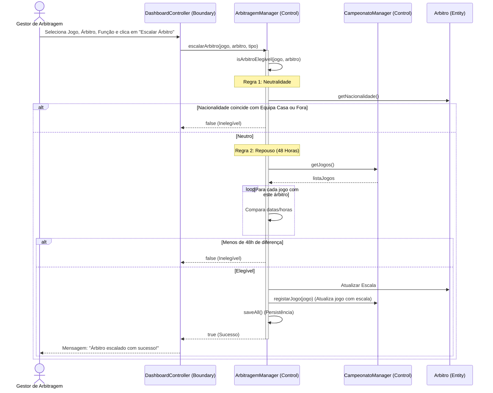
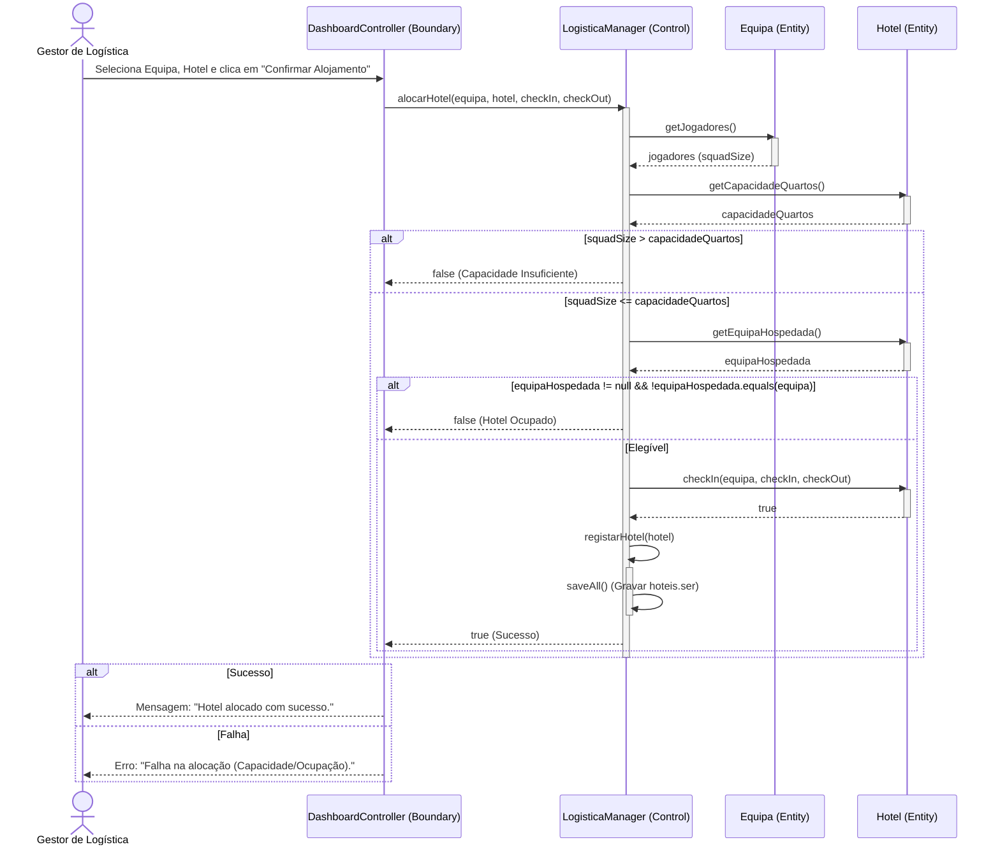

# Diagramas de Sequência em Mermaid — Gestão WC 2026

Estes diagramas replicam a estrutura **BCE (Boundary-Control-Entity)** / padrão **ICONIX** exigido para o projeto, em formato **Mermaid** para visualização interativa diretamente no GitHub ou editores compatíveis com Markdown.

---

### 1. Login & RBAC (Roteamento Dinâmico)


---

### 2. CU02 — Agendar Jogo


---

### 3. CU03 — Finalizar Jogo & Progresso do Bracket (Corrigido)


---

### 4. CU06 — Escalar Árbitro (Neutralidade e Repouso)


---

### 5. CU19 — Alocar Hotel (Logística)


---

### 6. CU23 — Compra de Bilhete com Regra Anti-Bot
```mermaid
sequenceDiagram
    actor P as Público / Adepto
    participant B as DashboardController (Boundary)
    participant C as BilheteiraManager (Control)
    participant CM as CampeonatoManager (Control)
    participant J as Jogo (Entity)
    participant E as Estadio (Entity)
    participant S as SetorEstadio (Entity)

    P->>B: Seleciona Jogo, Setor, Quantidade (Q) e clica "Comprar Bilhete"
    
    Note over B,C: Regra de Ética: Limite Anti-Bot (1 a 4)
    alt Q <= 0 ou Q > 4
        B-->>P: Erro: "Limite máximo de compra de 4 bilhetes..."
    else Q Válido (1 a 4)
        B->>C: venderBilhete(jogo, nomeSetor, Q)
        activate C
        C->>J: getEstadio()
        J-->>C: estadio
        C->>E: getSetorPorNome(nomeSetor)
        E-->>C: setor
        
        C->>S: venderBilhete(Q) (Valida capacidade restante)
        activate S
        alt Lugares Disponíveis >= Q
            S->>S: decrementa lugares disponíveis
            S-->>C: true
            deactivate S
            C->>CM: registarJogo(jogo) (Atualiza lotação)
            C->>C: regista novos Bilhete(s) na lista
            C->>C: saveAll() (Persistência)
            C-->>B: true
            B-->>P: Mensagem: "Compra efetuada com sucesso!"
        else Lotação Esgotada
            S-->>C: false
            deactivate S
            C-->>B: false
            deactivate C
            B-->>P: Erro: "Compra falhou. Capacidade excedida."
        end
    end
```
